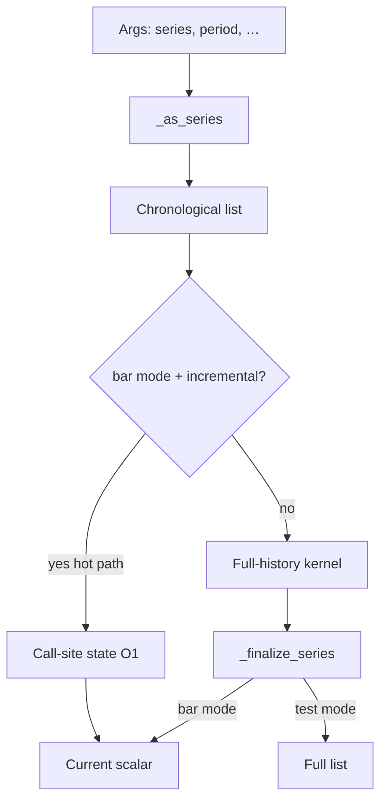

# Copyright (C) 2024-2026 jango_blockchained
#
# This file is part of pynescript.
#
# pynescript is free software: you can redistribute it and/or modify
# it under the terms of the GNU Affero General Public License as published by
# the Free Software Foundation, either version 3 of the License, or
# (at your option) any later version.
#
# pynescript is distributed in the hope that it will be useful,
# but WITHOUT ANY WARRANTY; without even the implied warranty of
# MERCHANTABILITY or FITNESS FOR A PARTICULAR PURPOSE.  See the
# GNU Affero General Public License for more details.
#
# You should have received a copy of the GNU Affero General Public License
# along with pynescript.  If not, see <https://www.gnu.org/licenses/>.
#
# SPDX-License-Identifier: AGPL-3.0-or-later

---
title: "Technical analysis (ta.*)"
description: "ta.* indicators: series helpers, bar mode, interpret↔compile parity, and submodule layout."
---

# Technical analysis (`ta.*`)

## Abstract

The `ta.*` namespace is the largest pure-compute surface in PYNE: moving averages, oscillators, volatility bands, volume studies, pattern helpers, and cross/rise/fall predicates. Implementations live under `technical_submodules/` and are composed into `TechnicalAnalysisMixin`. Numerical behavior is validated against TradingView reference series (see [numerical validation](/pyne/docs/reference/numerical-validation)); the design goal is IEEE-limit parity, not “approximate TA.” Interpret and compile (Numba) hosts share the same formulas for the kernels listed under [Interpret ↔ compile parity](#interpret--compile-parity).

## Conceptual model



Hosts in production set bar mode so indicator calls return **scalars for the active bar**, matching how Pine expressions compose (`ta.ema(a) - ta.ema(b)`).

### Incremental hot path (2026-07-28)

When `_pine_bar_mode` and `_pine_ta_incremental` are enabled (Runtime default; disable with **`PYNE_TA_INCREMENTAL=0`**), these builtins update **call-site state** once per bar instead of recomputing full history:

| Builtin | State model |
| --- | --- |
| `ta.sma` | Rolling window (deque) |
| `ta.ema` / `ta.rma` | Recursive seed + step |
| `ta.rsi` | Dual RMA of gains/losses |
| `ta.macd` | Fast/slow/signal EMAs in one slot |
| `ta.atr` | TR stream; mean warm-up then EMA-of-TR (matches current full oracle) |

Call sites are indexed like crossovers (`_ta_call_i` reset each bar). Nested forms such as `ta.ema(ta.sma(close, 14), 10)` stay correct because each call keeps its own slot. Golden suite: `tests/test_ta_incremental.py` (incremental last values ≡ full recompute).

## Interface surface

Dispatch keys (non-exhaustive; map is authoritative in `technical.py`):

| Family | Examples |
| --- | --- |
| Moving averages | `ta.sma`, `ta.ema`, `ta.wma`, `ta.rma`, `ta.hma`, `ta.vwma`, `ta.swma`, `ta.alma` |
| Oscillators | `ta.rsi`, `ta.stoch`, `ta.cci`, `ta.cmo`, `ta.mfi`, `ta.roc`, `ta.wpr`, `ta.tsi`, `ta.rci` |
| Trend / channels | `ta.macd`, `ta.adx`, `ta.dmi`, `ta.supertrend`, `ta.sar`, `ta.linreg` |
| Volatility | `ta.atr`, `ta.tr`, `ta.bb`, `ta.bbw`, `ta.kc`, `ta.kcw`, `ta.stdev`, `ta.variance` |
| Volume | `ta.obv`, `ta.vwap`, `ta.mfi` (shared), volume submodule helpers |
| Structure | `ta.highest` / `lowest` / `highestbars` / `lowestbars`, `ta.pivothigh` / `pivotlow` |
| Predicates | `ta.crossover`, `ta.crossunder`, `ta.cross`, `ta.rising`, `ta.falling` |
| Stats / other | `ta.change`, `ta.mom`, `ta.cum`, `ta.median`, `ta.mode`, percentiles, `ta.barssince`, `ta.valuewhen`, `ta.correlation` |

### Argument conventions

- Typical form: `ta.fn(series, length)`.
- Some functions allow **period-only** calls (e.g. `ta.highest(20)`) defaulting source to `high` / context series via `_expect_series(..., allow_period_only=True)`.
- Multi-value returns (e.g. MACD, BB, Supertrend) unpack as tuples/lists; assignment uses StatementEvaluator unpack rules.
- Fractional lengths floor to int (TradingView-compatible).

### Stateful crosses

`ta.crossover` / `ta.crossunder` need previous-bar pairs. In bar-mode runs the host resets a call-site index (`_cross_call_i`) each bar so multiple cross calls in one script keep independent state.

## Internals

| Path | Role |
| --- | --- |
| `src/pynescript/ast/evaluator/builtins/technical.py` | Dispatch map aggregation |
| `.../technical_submodules/core.py` | Series coerce, expect helpers, bar finalize, **incremental kernels** |
| `.../moving_averages.py`, `oscillators.py`, `volatility.py`, `volume.py`, … | Kernels + inc wiring |
| `.../common.py`, `basic.py`, `advanced.py`, `patterns.py`, `strategies.py`, `synthesizer.py`, `economics.py` | Additional families |
| `src/pynescript/compiler/numba_builtins.py` | Compile-path Numba kernels (must track interpret formulas) |
| `tests/test_ta_indicators_*.py`, `tests/test_indicators.py` | Regression |
| `tests/test_ta_incremental.py` | Inc ≡ full recompute golden (full CI gate) |
| `tests/test_first_party_ta_goldens.py` | Dual-host first-party goldens (ATR / Supertrend / Keltner) |
| `tests/test_interp_compile_parity.py` | Always-on dual-host smoke + full-corpus mark |
| `scripts/compare_interp_compile.py` | Corpus harness (report under `.cache/interp_compile_parity.json`) |
| `tests/test_compiler_numba.py` (`TestInterpCompilePlotParityFixes`, highestbars offsets, …) | Targeted formula locks |
| `docs/numerical_validation_report.md` | Published precision summary (TV / IEEE bounds) |

History for wrapper series is reversed to chronological order and may be truncated (`_SERIES_MAX`) before full kernels run. Incremental path only needs `series[-1]` per call, so truncation does not freeze state.

## Interpret ↔ compile parity

Numba kernels are **separate code** from the interpreter, but the dual-host contract is **same formula, same warm-up mask, same `na` rules** for the surface below. Drift is a bug, not an allowed “approx compile.” Prove regressions with the [interp↔compile harness](#parity-harness) and the [numerical validation](/pyne/docs/reference/numerical-validation) page (TV / IEEE bounds).

| Topic | Shared behavior |
| --- | --- |
| **`ta.rsi`** | **Wilder** on both hosts: SMA seed of the first `period` deltas, then RMA of gains/losses. First finite bar is index `period` (`period` deltas need `period+1` prices). Not a simple window average. |
| **`ta.roc`** | Standard TV formula `100 * (src - src[length]) / src[length]`. Warm-up is **`na`**, never an early `0.0`. Zero or missing baseline → `na`. Interpret no longer used a wrong lookback denominator or early zero. |
| **`ta.wma`** | Requires a **full non-`na` window** of length `N`. Nested forms such as `ta.wma(ta.roc(...), …)` stay `na` until the inner series has produced `N` finite samples (no partial-window reweight). |
| **`ta.cum`** | Running sum; Pine **`na` / IEEE NaN treated as 0** (skipped contribution), matching TradingView cumulative-sum semantics. |
| **`ta.highestbars` / `ta.lowestbars`** | Return **negative bars-back offsets**: `0` if the extreme is the current bar, `-1` one bar ago, …, `-(length-1)` at the far edge. Short history (`i + 1 < length`) returns `-1`. Matches Aroon-style scripts that index with `high[ta.highestbars(...)]` / `math.abs(ta.lowestbars(...))`. |
| **`math.avg` (multi-arg)** | Arithmetic mean of the arguments. **Any `na` argument → `na`** (do not skip). Not a rolling `ta.sma`. |
| **`ta.linreg`** | Least-squares fit over the window; **endpoint at `x = n−1` when `offset=0`** (TV): `mean_y + slope * ((n−1) − mean_x)` / compile `intercept + slope * (n − 1 − offset)`. Length &lt; 2 → `na`. |
| **`ta.mfi`** | Warm-up aligned on both hosts: needs **`length + 1` typical-price samples** (direction vs previous bar). Equal typical prices contribute to neither side; only-pos / only-neg MF → 100 / 0 (or 50 when both empty). |
| **`ta.rci`** | Rank Correlation Index (Spearman of time vs value ranks) is implemented on the **compile path** (`numba_rci`) as well as interpret; stays in numeric mode when called. |

**0.3.4+:** `ta.atr` uses Wilder RMA of TR on interpret + Numba; EMA dual-host seed is full-list SMA seed matching incremental/Numba. First-party dual-host goldens (ATR / Supertrend / Keltner) and `test_ta_incremental` gate residual drift. Any remaining gaps are tracked under [missing features](/pyne/docs/reference/missing-features)—not as silent “close enough” for the rows above.

### Parity harness

```bash
# Always-on smoke (stable scripts under tests/test_interp_compile_parity.py)
pytest tests/test_interp_compile_parity.py -q

# Corpus compare (default ~50 scripts × 1000 bars; writes report JSON)
python scripts/compare_interp_compile.py --bars 1000 --limit 50
python scripts/compare_interp_compile.py --glob 'average_*.pine' --bars 200

# Optional longer pytest path
pytest tests/test_interp_compile_parity.py -m interp_compile_full

# Formula locks (RSI/ROC/WMA/cum/math.avg/highestbars, …)
pytest tests/test_compiler_numba.py -k 'InterpCompilePlotParity or highestbars_lowestbars_negative' -q
```

Report path: `.cache/interp_compile_parity.json`. Methodology and acceptable relative-error bands vs TradingView: [Numerical validation](/pyne/docs/reference/numerical-validation).

## Invariants & edge cases

1. **Warm-up → `na`.** Insufficient bars (e.g. SMA length \(N\) needs \(N\) samples; RSI needs `period+1` prices) yield `None` / leading `na` in full-series mode.
2. **NA in window.** Many kernels propagate `na` if any window element is missing (SMA-like sums, **WMA**, MFI money-flow samples). **`ta.cum` is the TV exception** (`na` → 0 contribution).
3. **Default sources.** `ta.atr` pulls high/low/close from `current_series` / context when not passed explicitly.
4. **Compile kernels must track interpret.** Numba `numba_*` implementations are separate source; for the parity table above they are formula-locked by dual-host tests—do not “approximate” for speed.
5. **No chart look-ahead.** Kernels only see history available at the current bar index; `request.security` lookahead is a separate concern.
6. **Incremental ≡ full recompute (oracle).** Changing seed rules (e.g. ATR Wilder vs EMA-of-TR) is a correctness project, not a silent perf flag.

## Worked examples

### Classic overlay

```pine
//@version=6
indicator("SMA 14")
v = ta.sma(close, 14)
plot(v)
```

In bar mode each visit returns one float (or `na`); the host stacks them into a series for the response envelope.

### Cross entry signal

```pine
//@version=6
strategy("X")
fast = ta.ema(close, 12)
slow = ta.ema(close, 26)
if ta.crossover(fast, slow)
    strategy.entry("L", strategy.long)
```

Cross state is bar-local; ensure the runtime resets cross call indices when reusing an evaluator.

### Multi-value unpack

```pine
[macdLine, signal, hist] = ta.macd(close, 12, 26, 9)
plot(hist)
```

## Failure modes

| Symptom | Cause |
| --- | --- |
| Always `na` | Length longer than available history; or series not updated |
| Wrong vs TV by large margin | Wrong source series; mock OHLCV; or non-bar-mode list composition bug |
| Cross never fires | Call-index state not reset / shared incorrectly across bars |
| Compile diverges from interpret | Kernel drift in `numba_builtins.py` (RSI must stay Wilder; ROC warm-up must stay `na`; WMA full window; highestbars sign; `math.avg` na rule)—re-run the [parity harness](#parity-harness) |
| Early ROC / nested WMA finite too soon | Legacy quirks: ROC returned `0.0` before lookback, or WMA reweighted partial/`na` windows—fixed on both hosts |
| `high[ta.highestbars(...)]` mostly `na` | Offsets are **negative**; only offset `0` indexes the current bar without `math.abs` |
| `math.avg` finite when an arg is `na` | Bug: multi-arg avg must propagate `na`, not skip |

## See also

- [Series & history](/pyne/docs/runtime/series-and-history)
- [Strategy builtins](/pyne/docs/runtime/builtins/strategy)
- [Numba path](/pyne/docs/runtime/compiler/numba)
- [Numerical validation](/pyne/docs/reference/numerical-validation)
- [Missing features](/pyne/docs/reference/missing-features) (residual dual-host gaps)
- [Compiler overview](/pyne/docs/runtime/compiler/overview)
