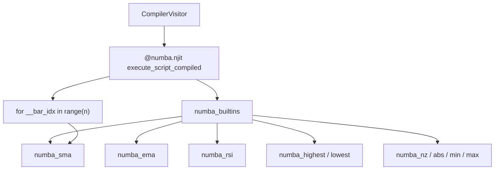

# Numba path

## Abstract

Numeric compile mode emits a single `@numba.njit` function whose body is the script’s bar loop. Pine builtins that cannot cross the JIT boundary are replaced by **hand-written kernels** in `numba_builtins.py` that take full arrays plus the current index. The result is large speedups on multi-thousand-bar series after a one-time JIT warm-up—at the cost of a restricted language subset and `np.nan` as the missing-value sentinel.

## Conceptual model



## Interface surface

Kernels (all `@numba.njit(cache=True)` at definition site; generated entry uses `cache=False`):

| Kernel | Semantics sketch |
| --- | --- |
| `numba_sma(arr, period, i)` | Mean of `arr[i-period+1 : i]`; `nan` if warm-up or any window `nan` |
| `numba_ema(arr, period, i)` | SMA seed over first `period` bars, then EMA to `i` |
| `numba_rsi(arr, period, i)` | Average gain/loss form; 100 if avg loss 0 |
| `numba_highest` / `numba_lowest` | Window extrema; window clamps at 0 |
| `numba_nz(val, replacement)` | Replace `nan` |
| `numba_abs` / `numba_min` / `numba_max` | Scalar helpers |

Generated code imports `from pynescript.compiler.numba_builtins import *` so call sites are bare names.

### History access

`close[n]` lowers to array indexing at `__bar_idx - n` with bounds → `nan` (parallel to interpreter `None`, different sentinel).

### Control flow

`if` / `for` / `while` emit Python control flow **inside** the njit function—supported Numba subset only (no heap objects, no Python lists of mixed types).

## Internals

| Path | Role |
| --- | --- |
| `src/pynescript/compiler/numba_builtins.py` | Kernels |
| `src/pynescript/compiler/compiler.py` | `_emit_numeric_mode`, call lowering |
| `src/pynescript/compiler/engine.py` | Requires `_HAS_NUMBA` when not object_mode |
| `tests/test_compiler_numba.py` | Correctness |

Expanding coverage is primarily **new kernels + visitor call mapping**, not changes to the bar-loop skeleton.

## Invariants & edge cases

1. **No Python objects in numeric mode.** Strings, UDTs, maps, drawings force object mode before njit is applied.
2. **Warm-up cost.** First `compile_script` invokes a dummy run; production servers should cache `CompiledScript`.
3. **EMA/RSI definitions** are explicit in source—document any intentional deviation when comparing to interpret `ta.*` for edge seeds.
4. **`cache=False` on entry.** Do not expect Numba’s on-disk cache to key generated functions across processes without further work.
5. **Anaconda static libpython.** Packaging notes in AGENTS/build docs apply when shipping JIT-heavy binaries.

## Worked examples

### Benchmark mental model

```text
interpret:  O(bars × ast_nodes × python_dispatch)
numeric:    O(bars × lowered_ops) in machine code after JIT
```

For simple SMA scripts, internal notes cite order-of-magnitude speedups versus list-based interpretation on long series (see `docs/COMPILER_PLAN.md` qualitative claims).

### Using from Pro API

```python
Runtime(...).run(source, ohlcv, mode="compile")
```

Converts bar dicts → arrays, compiles, reshapes plots into the standard envelope, flags `object_mode` when applicable.

## Failure modes

| Symptom | Cause |
| --- | --- |
| TypingError from Numba | Unsupported construct leaked into numeric emit |
| All-`nan` plots | Period longer than series; or history index bugs |
| ImportError numba | Environment missing dependency |
| Divergent RSI vs interpret | Seed / average method—file fixture and compare both paths |
| Object mode unexpectedly | Visitor detected drawing/UDT/map—inspect `visitor.object_mode` |

## Performance notes

- Prefer **one compile, many runs** with different OHLCV.
- Keep scripts in the numeric subset for realtime ticks.
- Object mode still wins over AST walking for UDT-heavy scripts but will not match peak njit throughput.

## See also

- [Compiler overview](/pyne/docs/runtime/compiler/overview)
- [Technical builtins (interpret)](/pyne/docs/runtime/builtins/technical)
- [Series & history](/pyne/docs/runtime/series-and-history)
