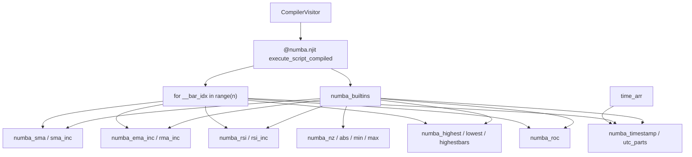

# Copyright (C) 2024-2026 jango_blockchained
#
# This file is part of pynescript.
#
# pynescript is free software: you can redistribute it and/or modify
# it under the terms of the GNU Affero General Public License as published by
# the Free Software Foundation, either version 3 of the License, or
# (at your option) any later version.
#
# pynescript is distributed in the hope that it will be useful,
# but WITHOUT ANY WARRANTY; without even the implied warranty of
# MERCHANTABILITY or FITNESS FOR A PARTICULAR PURPOSE.  See the
# GNU Affero General Public License for more details.
#
# You should have received a copy of the GNU Affero General Public License
# along with pynescript.  If not, see <https://www.gnu.org/licenses/>.
#
# SPDX-License-Identifier: AGPL-3.0-or-later

---
title: "Numba path"
description: "JIT bar loops, numba_builtins kernels, NA-as-NaN, and performance characteristics."
---

# Numba path

## Abstract

Numeric compile mode emits a single `@numba.njit` function whose body is the script’s bar loop. Pine builtins that cannot cross the JIT boundary are replaced by **hand-written kernels** in `numba_builtins.py` that take full arrays plus the current index (or a small float state vector for `*_inc` forms). The result is large speedups on multi-thousand-bar series after a one-time JIT warm-up—at the cost of a restricted language subset and `np.nan` as the missing-value sentinel.

Kernel contracts below match interpret `ta.*` / calendar helpers where parity was fixed; intentional deviations should be documented on the kernel docstring and here.

## Conceptual model



## Interface surface

Kernels are defined with `@numba.njit(cache=True)` in `numba_builtins.py`. Generated entry points use `@numba.njit(cache=False)` in the in-memory IR string; when the engine writes a **disk IR** module it rewrites that decorator to `cache=True` so Numba can store machine code next to a real file path (see [Cache](#cache)).

Generated code imports `from pynescript.compiler.numba_builtins import *` so call sites are bare names. Prefer `*_inc` when the visitor allocates fixed state (`__ema0_st`, …).

### Kernel table (interpret-parity highlights)

| Kernel | Semantics |
| --- | --- |
| `numba_sma(arr, period, i)` | Mean of last `period` bars ending at `i`; `nan` if warm-up or any window `nan` |
| `numba_ema` / `numba_ema_inc` | SMA seed, then EMA (`α = 2/(period+1)`). **Inc seed is NaN-safe**: while the accumulator is still `nan` and `j >= period-1`, try SMA over `arr[j-period+1 : j+1]` only when every sample is finite. Nested EMA / DEMA no longer stuck all-NaN after leading NaNs |
| `numba_rma_inc(arr, period, i, st)` | Wilder RMA with the **same NaN-window-safe SMA seed** as `numba_ema_inc`. After seed, NaN inputs hold the previous RMA. Required for `rma(tr)` / expanded ADX so compile is not all-NaN or ~0 after warm-up |
| `numba_rsi` / `numba_rsi_inc` | **Wilder RSI**, not rolling simple-window RSI. SMA of first `period` deltas (bars `1..period`), then RMA of gain/loss (`α = 1/period`). First valid bar is **`i == period`** (`period` deltas need `period+1` prices). `avg_loss == 0` → `100.0` |
| `numba_highest` / `numba_lowest` | Window extrema; full window required (`i >= period-1`); NaN samples skipped |
| `numba_highestbars` / `numba_lowestbars` (+ `_inc`) | TV **negative** bars-back offsets: `0` if current is extreme, `-1` one bar ago, …, `-(length-1)`. Returns **`-1.0`** when window not full, invalid length, or all-NaN. **Oldest** extreme wins ties (strict `>` / `<`) |
| `numba_roc(arr, length, i)` | `100 * (src - src[length]) / src[length]` at bar `i`; `nan` if `i < length`, baseline 0/NaN, or src NaN |
| `numba_timestamp(y, m, d, h=0, mi=0, s=0)` | UTC epoch **ms** from calendar components; month/day overflow normalized (e.g. `month=0` → prior Dec) for TTM-style windows |
| `numba_utc_parts(ms)` | `(year, month, dayofmonth, hour, minute, second, dayofweek)` floats; Pine `dayofweek` is `1=Sun … 7=Sat` |
| `numba_nz(val, replacement)` | Replace `nan` |
| `numba_abs` / `numba_min` / `numba_max` | Scalar helpers |

Full inventory lives in `src/pynescript/compiler/numba_builtins.py` (njit batch + `*_inc` + pure-Python object-mode helpers).

### Calendar / `time_arr`

Bar open time is the host `time_arr` series (synthetic when the runner omits timestamps).

| Pine form | Lowering |
| --- | --- |
| bare `year` / `month` / `dayofmonth` / `hour` / `minute` / `second` / `dayofweek` | `numba_utc_parts(time_arr[__bar_idx])[idx]` |
| `year(t)` … (optional time arg) | `numba_utc_parts(src)[idx]` with `src` defaulting to `time_arr[__bar_idx]` |
| `timestamp(y, m, d[, h, mi, s])` | `numba_timestamp(...)` (leading timezone string args dropped → UTC stub) |
| `time` / `time_close` (approx) | `time_arr[__bar_idx]` / `+ 59999` ms |

### History access

`close[n]` lowers to array indexing at `__bar_idx - n` with bounds → `nan` (parallel to interpreter `None`, different sentinel).

### Control flow

`if` / `for` / `while` / `once` emit Python control flow **inside** the njit function—supported Numba subset only (no heap objects, no Python lists of mixed types). `once` lowers to a persistent `__once_fired_N` bool set when the body runs (compile is historical: `barstate.isconfirmed` is always true). A `once` inside a UDF forces object mode so the flag is module-level.

## Cache

Three layers interact:

| Layer | Location / key | Role |
| --- | --- | --- |
| Source LRU | in-process, sha256 of source | `CompiledScript` reuse |
| IR LRU | in-process, sha256 of generated Python | share warm callable across comment-only variants |
| Disk IR | `PYNE_COMPILE_CACHE_DIR` or `$XDG_CACHE_HOME/pynescript/compile` | persist generated modules; disable with `PYNE_COMPILE_DISK_CACHE=0`. Index JSON `"v"` must equal `engine._DISK_META_VERSION` (**9**) |

**Numba function cache (`.nbi` / `.nbc`):**

- Hand-written kernels: `@njit(cache=True)` → artifacts under `…/pynescript/compiler/__pycache__/`.
- Generated entry: IR is emitted with `cache=False` (safe for `exec` from `<string>`). Disk write rewrites `@numba.njit(cache=False)` → `cache=True` so Numba’s file locator can cache machine code under the disk IR `__pycache__/`.
- Truncated/corrupt pickle loads raise `EOFError` / `UnpicklingError`. The engine purges known `.nbi`/`.nbc` via `clear_numba_function_caches()` and recompiles once instead of failing the script.

```python
from pynescript.compiler import clear_numba_function_caches, clear_disk_compile_cache
clear_numba_function_caches()
clear_disk_compile_cache()
```

## Internals

| Path | Role |
| --- | --- |
| `src/pynescript/compiler/numba_builtins.py` | Kernels (`cache=True`) |
| `src/pynescript/compiler/compiler.py` | `_emit_numeric_mode`, call lowering, `time_arr` calendar |
| `src/pynescript/compiler/engine.py` | Disk IR rewrite, Numba cache recovery, prewarm |
| `tests/test_compiler_numba.py` | Correctness / parity |

Expanding coverage is primarily **new kernels + visitor call mapping**, not changes to the bar-loop skeleton.

## Invariants & edge cases

1. **No Python objects in numeric mode.** Strings, UDTs, maps, drawings force object mode before njit is applied.
2. **Warm-up cost.** First `compile_script` invokes a dummy run; production servers should cache `CompiledScript` and prewarm (`PYNE_COMPILE_PREWARM` default **on**, `POST /compile/prewarm`).
3. **EMA/RMA seed** uses sliding all-finite SMA windows—not “seed once at bar `period-1` only if that fixed slice is clean.” Leading NaN on `tr` / nested EMA sources must eventually produce values.
4. **RSI is Wilder**, first valid at `i == period`. Do not compare against a simple N-bar average-gain RSI.
5. **highestbars/lowestbars** return negative offsets and `-1` on incomplete windows; ties keep the oldest bar.
6. **Disk entry cache** requires the rewrite to a real file path; pure `exec` of `cache=False` IR does not populate Numba’s on-disk function cache for the entry function.
7. **Anaconda static libpython.** Packaging notes in AGENTS/build docs apply when shipping JIT-heavy binaries.

## Worked examples

### Benchmark mental model

```text
interpret:  O(bars × ast_nodes × python_dispatch)
numeric:    O(bars × lowered_ops) in machine code after JIT
```

For simple SMA scripts, internal notes cite order-of-magnitude speedups versus list-based interpretation on long series (see repo `docs/COMPILER_PLAN.md` qualitative claims).

### Using from Pro API

```python
Runtime(...).run(source, ohlcv, mode="compile")
```

Converts bar dicts → arrays (including `time=` bar-open ms), compiles, reshapes plots into the standard envelope, flags `object_mode` when applicable. `generated_code` is omitted unless `PYNESCRIPT_RETURN_GENERATED_CODE=1`.

## Failure modes

| Symptom | Cause |
| --- | --- |
| TypingError from Numba | Unsupported construct leaked into numeric emit |
| All-`nan` plots | Period longer than series; history index bugs; or (fixed) NaN-poisoned EMA/RMA seed on nested sources |
| Nested DEMA / `rma(tr)` all-NaN | Pre-fix seed; current kernels sliding-window all-finite SMA seed |
| RSI diverges vs interpret | Expect Wilder seed/RMA, not rolling window RSI |
| `highestbars` sign / magnitude off | TV negative offsets; incomplete window → `-1` |
| `EOFError` / UnpicklingError at load | Corrupt `.nbi`/`.nbc` — engine purges and retries; manual `clear_numba_function_caches()` |
| ImportError numba | Environment missing dependency |
| Object mode unexpectedly | Visitor detected drawing/UDT/map—inspect `visitor.object_mode` |

## Performance notes

- Prefer **one compile, many runs** with different OHLCV.
- Keep scripts in the numeric subset for realtime ticks.
- Host prewarm of `numba_builtins` + common scripts shifts cold JIT off the first user request.
- Object mode still wins over AST walking for UDT-heavy scripts but will not match peak njit throughput.

## See also

- [Compiler overview](/pyne/docs/runtime/compiler/overview)
- [Technical builtins (interpret)](/pyne/docs/runtime/builtins/technical)
- [Series & history](/pyne/docs/runtime/series-and-history)
