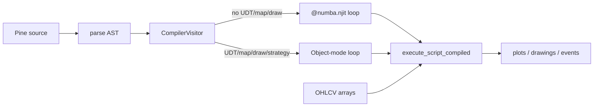

# Copyright (C) 2024-2026 jango_blockchained
#
# This file is part of pynescript.
#
# pynescript is free software: you can redistribute it and/or modify
# it under the terms of the GNU Affero General Public License as published by
# the Free Software Foundation, either version 3 of the License, or
# (at your option) any later version.
#
# pynescript is distributed in the hope that it will be useful,
# but WITHOUT ANY WARRANTY; without even the implied warranty of
# MERCHANTABILITY or FITNESS FOR A PARTICULAR PURPOSE.  See the
# GNU Affero General Public License for more details.
#
# You should have received a copy of the GNU Affero General Public License
# along with pynescript.  If not, see <https://www.gnu.org/licenses/>.
#
# SPDX-License-Identifier: AGPL-3.0-or-later

---
title: "Compiler overview"
description: "Source-to-source compilation: CompilerVisitor, numeric vs object mode, and engine API."
---

# Compiler overview

## Abstract

The compile path lowers Pine’s ASDL AST to **executable Python** that walks bars with an explicit index (`__bar_idx`) over contiguous `numpy` arrays—avoiding per-node visitor overhead. Pure numeric scripts wrap the loop in `@numba.njit`; scripts that touch UDTs, maps, or drawings select **object mode** (still a tight Python/numpy loop, no AST walk). The public façade is `pynescript.compiler.engine` (`transpile`, `compile_script`, `run_script`), also reachable as `Runtime.run(..., mode="compile")`.

This is an MVP with growing surface—not a full substitute for the interpreter on every script.

## Conceptual model



## Interface surface

```python
from pynescript.compiler.engine import transpile, compile_script, run_script, has_numba

src = transpile(pine_text)           # generated Python string
cs = compile_script(pine_text)       # CompiledScript
result = cs.run(open, high, low, close, volume)
# result: dict of plot title → float64 array, optional __drawings, __events, …
```

| API | Role |
| --- | --- |
| `transpile` | Parse + visit → source string (inspect/debug) |
| `compile_script` | `exec` generated code, warm-up call, return `CompiledScript` |
| `run_script` | One-shot compile+run (prefer cache `CompiledScript` for batches) |
| `has_numba` | Numeric mode prerequisite |
| `prewarm_numba_builtins` / `prewarm_scripts` | Host cold-start (H2 warm path) |
| `compile_cache_stats` / `compile_deploy_config` | Cache + deploy diagnostics |

`CompiledScript` fields: `source`, `generated_code`, `execute`, `plot_titles`, `object_mode`, optional `nopython_fallback_reason`.

### Warm compile (product defaults)

Pro API `/run` defaults to **`mode=auto`** (compile when safe, interpret on fallback). Disk IR cache is **on** (`PYNE_COMPILE_DISK_CACHE=1`); Docker sets `PYNE_COMPILE_CACHE_DIR=/data/compile-cache`. Operators call `POST /compile/prewarm` or `pynescript prewarm` so first interactive latency skips Numba cold JIT. See [COMPILER_PLAN.md](/docs/COMPILER_PLAN.md) for SLOs and env flags.

### Mode selection

`CompilerVisitor` sets `object_mode = True` when it sees:

- User-defined types / enums
- Map operations
- Drawing APIs / certain plot variants
- Strategy usage (object mode + `CompileStrategyBroker`)

Otherwise **numeric mode** requires Numba installed.

### What numeric mode lowers today

Series assigns, arithmetic/logic, history (`close[n]`), `if`/`for`/`while`, selected `ta.*` (`sma`, `ema`, `rsi`, `highest`, `lowest`), scalar math helpers, `plot`, `input.*` defaults, `var`/`varip` carry—executed under `@numba.njit(cache=False)` (`cache=False` because code is `exec`’d from a string without a stable disk locator).

### Object mode extras

- UDT instances as field dicts
- Maps as Python dicts
- `__drawings` list of structured events
- Optional `__strategy` broker: pending fills, position, `__events`, equity snapshots

## Internals

| Path | Role |
| --- | --- |
| `src/pynescript/compiler/compiler.py` | `CompilerVisitor`, emit numeric/object |
| `src/pynescript/compiler/numba_builtins.py` | JIT kernels |
| `src/pynescript/compiler/strategy_broker.py` | Compile broker |
| `src/pynescript/compiler/engine.py` | Façade + result normalize |
| `backend/runtime.py` | `_run_compiled` envelope → plots/series |
| `tests/test_compiler_numba.py`, `test_compiler_objects.py`, `test_compiler_strategy.py` | Coverage |
| `docs/COMPILER_PLAN.md` | Design history and remaining work |

### Data layout

Unlike interpreter `PineSeries` deques:

```text
open_arr, high_arr, low_arr, close_arr, vol_arr   # inputs
user_arr = np.full(n_bars, np.nan)                 # or dtype=object for UDT
plot_i   = np.full(n_bars, np.nan)
for __bar_idx in range(n_bars):
    user_arr[__bar_idx] = …
    plot_i[__bar_idx] = …
```

`var` lowers to “init only when still na / first write” patterns so carry matches Pine without declaration sets.

## Invariants & edge cases

1. **Same AST front-end.** No second parser—compile bugs are lowering bugs.
2. **OHLCV length equality** enforced in `CompiledScript.run`.
3. **Warm-up** ignores exceptions on a dummy 16-bar series (JIT or first-run).
4. **Result normalization** converts Numba typed maps to plain dicts; `__drawings` stays a Python list.
5. **Interpret remains default.** Full strategy analytics, request.*, and exotic builtins stay interpret-first until lowered.

## Worked example

Pine:

```pine
//@version=5
indicator("c")
s = ta.sma(close, 14)
plot(s, "sma")
```

Generated shape (illustrative):

```python
@numba.njit(cache=False)
def execute_script_compiled(open_arr, high_arr, low_arr, close_arr, vol_arr):
    n_bars = len(close_arr)
    s_arr = np.full(n_bars, np.nan)
    plot_0 = np.full(n_bars, np.nan)
    for __bar_idx in range(n_bars):
        s_arr[__bar_idx] = numba_sma(close_arr, 14, __bar_idx)
        plot_0[__bar_idx] = s_arr[__bar_idx]
    return {'sma': plot_0}
```

## Failure modes

| Symptom | Cause |
| --- | --- |
| `numba is required for numeric compile mode` | Install numba or simplify script into object mode triggers |
| Empty generated code | Visitor returned blank—unsupported top-level shape |
| Missing `execute_script_compiled` | Emit bug or failed `exec` |
| Silent semantic drift | Kernel seed differences—diff against interpret on fixtures |
| Strategy metrics missing | Use interpret or check `__events` / broker fields only |

## Remaining work (summary)

Expand Numba `ta.*` surface, richer drawings, nested UDT methods, disk cache of generated modules, and systematic interpret↔compile parity tests per lowered construct. See `docs/COMPILER_PLAN.md` for the living checklist.

## See also

- [Numba path](/pyne/docs/runtime/compiler/numba)
- [Strategy broker](/pyne/docs/runtime/compiler/strategy-broker)
- [Runtime hub](/pyne/docs/runtime)
- [Numerical validation](/pyne/docs/reference/numerical-validation)
