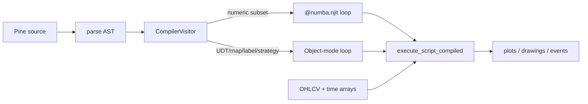

# Copyright (C) 2024-2026 jango_blockchained
#
# This file is part of pynescript.
#
# pynescript is free software: you can redistribute it and/or modify
# it under the terms of the GNU Affero General Public License as published by
# the Free Software Foundation, either version 3 of the License, or
# (at your option) any later version.
#
# pynescript is distributed in the hope that it will be useful,
# but WITHOUT ANY WARRANTY; without even the implied warranty of
# MERCHANTABILITY or FITNESS FOR A PARTICULAR PURPOSE.  See the
# GNU Affero General Public License for more details.
#
# You should have received a copy of the GNU Affero General Public License
# along with pynescript.  If not, see <https://www.gnu.org/licenses/>.
#
# SPDX-License-Identifier: AGPL-3.0-or-later

---
title: "Compiler overview"
description: "Source-to-source compilation: CompilerVisitor, numeric vs object mode, run(time=…), and engine API."
---

# Compiler overview

## Abstract

The compile path lowers Pine’s ASDL AST to **executable Python** that walks bars with an explicit index (`__bar_idx`) over contiguous `numpy` arrays—avoiding per-node visitor overhead. Pure numeric scripts wrap the loop in `@numba.njit`; scripts that touch UDTs, maps, drawings, or strategy select **object mode** (a tight Python/numpy loop, no AST walk). **Numba is required only for numeric mode**; object mode runs with numpy alone. **`once`** (0.4.4) lowers to a persistent `__once_fired_N` flag; UDF-scoped `once` forces object mode.

The public façade is `pynescript.compiler.engine` (`transpile`, `compile_script`, `run_script`), also reachable as `Runtime.run(..., mode="compile")` or `mode="auto"`.

This is an MVP with growing surface—not a full substitute for the interpreter on every script (notably multi-asset `request.*` and full strategy analytics). **0.3.16–0.3.17** recovered a large object-mode residual class: UDF locals, nopython `None`/unicode helpers, matrix handles, UDT returns, statement `switch` assign, drawing/`chart.point` copy, `round()` extras, import stubs as `na`, color type dispatch, and nested UDT method fields. Plot-value MISMATCH vs interpret (**P1p**) remains a residual, not a missing language surface.

## Conceptual model



Generated entry point is always:

```text
execute_script_compiled(open_arr, high_arr, low_arr, close_arr, vol_arr, time_arr)
```

Host packing lives in `engine.CompiledScript.run` (and `pynescript.runtime.Runtime._run_compiled`).

## Interface surface

```python
from pynescript.compiler.engine import transpile, compile_script, run_script, has_numba

src = transpile(pine_text)           # generated Python string
cs = compile_script(pine_text)       # CompiledScript
result = cs.run(open, high, low, close, volume, time=None)
# result: dict of plot title → float64 array, optional __drawings, __events, …
```

| API | Role |
| --- | --- |
| `transpile` | Parse + visit → source string (inspect/debug) |
| `compile_script` | `exec` generated code, warm-up call, return `CompiledScript` |
| `run_script` | One-shot compile+run (prefer cache `CompiledScript` for batches) |
| `has_numba` | Whether numeric (njit) mode can load |
| `prewarm_numba_builtins` / `prewarm_scripts` | Host cold-start (H2 warm path) |
| `compile_cache_stats` / `compile_deploy_config` | Cache + deploy diagnostics |
| `clear_compile_cache` | In-process LRU only |
| `clear_disk_compile_cache` | Disk IR / index under cache dir |
| `clear_numba_function_caches` | Purge Numba `.nbi`/`.nbc` under known dirs |

`CompiledScript` fields: `source`, `generated_code`, `execute`, `plot_titles`, `plot_kinds` (per-plot `plot` / `hline` / `fill` tags used to synthesize numeric-mode `__drawings`), `object_mode`, optional `nopython_fallback_reason`.

### `CompiledScript.run` signature

```python
def run(
    self,
    open_, high, low, close,
    volume=None,   # default: ones
    time=None,     # bar-open Unix ms; optional 6th series
) -> dict[str, Any]:
```

| Argument | Behavior |
| --- | --- |
| OHLCV | Coerced to contiguous `float64`; lengths must match (`ValueError` otherwise) |
| `volume=None` | Filled with ones |
| `time=None` | Synthetic `bar_index * 60_000` ms (unit-test / pure-compile default) |
| `time=arr` | Real bar-open timestamps; length must match OHLCV |

`Runtime._run_compiled` packs OHLCV dicts and **passes real bar times** so calendar/`time`/`timestamp`/`time[n]` stay aligned with interpret. Pure `cs.run(o,h,l,c)` without `time=` is fine for pure-price scripts and fixtures.

<Note>
When `time` is omitted, the engine synthesizes `np.arange(n) * 60000.0` (1-minute bar opens from epoch). Hosts that care about `year`/`month`/`time[n]` must pass bar-open Unix ms.
</Note>

### Warm compile (product defaults)

Pro API `/run` defaults to **`mode=auto`** (compile when eligible, interpret on fallback with `compile_fallback_reason`). Disk IR cache is **on** (`PYNE_COMPILE_DISK_CACHE=1`); Docker sets `PYNE_COMPILE_CACHE_DIR=/data/compile-cache`. Operators call `POST /compile/prewarm` or `pynescript prewarm` so first interactive latency skips Numba cold JIT. Design notes live in repo `docs/COMPILER_PLAN.md` (not a product page).

`Runtime._compile_eligible` (used by `mode=auto`) **skips compile** when the source contains a top-level `import` or any `request.` token — those stay interpret even though the emitter can lower same-symbol `request.security`. Explicit `mode=compile` still attempts the visitor.

### Mode selection

`CompilerVisitor` sets `object_mode = True` when it sees:

- User-defined types / enums
- Map / array / matrix handles that cannot stay float64
- Drawing constructors (`label.new`, `line.new`, …) and assigned `hline` handles
- Strategy usage (object mode + `CompileStrategyBroker`)
- String/color series, library imports, or other non-numeric constructs

**Statement-form** `hline(price)` / `fill(...)` with a proven-numeric price **stay nopython**: they emit a constant (or all-`nan`) series plus `plot_kinds` metadata; the engine synthesizes `__drawings` after the JIT loop. Mixed scripts that later flip object mode replay those events into the body.

Otherwise **numeric mode** is preferred. Numeric mode **requires Numba** at load/warm-up; missing Numba raises `CompileNumbaRequiredError`. Object mode does **not** need Numba (still star-imports `numba_builtins` for `safe_*` / non-jitted helpers).

On numeric warm-up **TypingError** / nopython failure, the engine re-emits with `force_object_mode=True` and records `nopython_fallback_reason`—so `mode="compile"` can still run without hard-failing on partial numeric coverage.

<Note>
Numba is **not** a hard requirement for all compile. Object-mode scripts (strategy, drawings, UDT, maps) execute without it. Only a pure-numeric emit that never flips to object mode needs Numba installed.
</Note>

### What numeric mode lowers today

Series assigns, arithmetic/logic, history (`close[n]`), `if`/`for`/`while`, selected `ta.*` (and bare TA aliases), scalar math helpers, `plot`, `input.*` defaults, `var`/`varip` carry—executed under `@numba.njit(cache=False)` on the generated entry (`cache=False` because code is `exec`’d from a string without a stable disk locator). Disk-cached IR modules may rewrite to `cache=True` for cross-process reuse of machine code.

### Object mode extras

- UDT instances as field dicts
- Maps as Python dicts
- `__drawings` list of structured events
- Optional `__strategy` broker: pending fills, position, `__events`, equity snapshots

### Compile-path limits (notable)

| Construct | Compile behavior |
| --- | --- |
| `request.security` / bare `security` / `request.security_lower_tf` / `request.seed` | **Same-symbol, simple OHLCV expression only** (chart identity + bare `close`/`high`/… style). Foreign symbol or complex expression → `np.nan` (no inventing chart close as foreign data). Other `request.*` → object-mode `np.nan` stub |
| Bare builtins vs user series | User-defined series arrays win in `visit_Name`: `ad = ta.cum(...)` / `tr = …` shadow bare `ad`/`tr` formulas so `plot(ad)` is not silently re-bound to the builtin |
| `hline(...)` | Statement-form + numeric price → **nopython** constant series (`hline`, `hline_2`, …) + synthesized `__drawings`. Assigned / non-numeric handles → object mode |
| `fill(..., title=…)` | Statement-form → **nopython** all-`nan` series key (band color in `plot_meta` / drawings). Expression-form / mixed object scripts emit `__drawings` in-loop |

<Warning>
Compile-path `request.security` never invents foreign OHLCV from chart close. Foreign tickers and complex expressions (UDFs, `ta.*` inside the third arg, multi-value constructs beyond simple chart series) lower to `np.nan`. Use interpret + a real `data_feed` / `data_provider` for multi-asset work.
</Warning>

## Internals

| Path | Role |
| --- | --- |
| `src/pynescript/compiler/compiler.py` | `CompilerVisitor`, emit numeric/object, security/name/fill/hline lowering |
| `src/pynescript/compiler/numba_builtins.py` | JIT kernels + object-mode `safe_*` |
| `src/pynescript/compiler/strategy_broker.py` | Compile broker |
| `src/pynescript/compiler/engine.py` | Façade, caches, `CompiledScript.run`, Numba cache recovery |
| `src/pynescript/runtime/host.py` | Package SoT `Runtime._run_compiled` envelope; packs OHLCV + `time=` |
| `backend/runtime.py` | Compat re-export of `pynescript.runtime.host` |
| `scripts/compare_interp_compile.py` | Interpret↔compile series parity harness |
| `tests/test_compiler_numba.py`, `test_compiler_objects.py`, `test_compiler_strategy.py` | Coverage |
| `docs/COMPILER_PLAN.md` | Design history and remaining work (repo, not hosted) |

### Data layout

Unlike interpreter `PineSeries` deques:

```text
open_arr, high_arr, low_arr, close_arr, vol_arr, time_arr
user_arr = np.full(n_bars, np.nan)                 # or dtype=object for UDT
plot_i   = np.full(n_bars, np.nan)
for __bar_idx in range(n_bars):
    user_arr[__bar_idx] = …
    plot_i[__bar_idx] = …
```

- Bare `time` / `time_close` / `last_bar_time` / calendar extractors read `time_arr` (synthetic when omitted).
- `var` lowers to “init only when still na / first write” patterns so carry matches Pine without declaration sets.
- Numeric mode returns a **tuple** of plot arrays (host maps titles); object mode returns a **dict** (plots + `__drawings` / strategy extras).

### Caches and corrupt-Numba recovery

Three layers:

1. **In-process source LRU** (sha256 of raw and/or sanitized source) + secondary IR cache keyed by generated-code hash.
2. **Disk IR** (default on): modules under `PYNE_COMPILE_CACHE_DIR` or `$XDG_CACHE_HOME/pynescript/compile`. The source→IR index JSON carries `"v": 9` (`engine._DISK_META_VERSION`). Bump that integer when generated IR semantics change so stale modules are ignored (source hash alone is stable across emitter fixes).
3. **Numba function cache** (`.nbi` / `.nbc`) next to `numba_builtins` and under disk-IR `__pycache__/`.

Truncated/corrupt Numba pickle files raise `EOFError` / `pickle.UnpicklingError` on load. The engine wraps execute/warm paths with **purge + single retry** via `clear_numba_function_caches` (does not fail the script for a bad cache alone). Manual clean slate:

```python
from pynescript.compiler import (
    clear_compile_cache,
    clear_disk_compile_cache,
    clear_numba_function_caches,
)
clear_compile_cache()
clear_disk_compile_cache()
clear_numba_function_caches()
# shell: rm -rf ~/.cache/pynescript/compile \
#   src/pynescript/compiler/__pycache__/numba_builtins*.nb*
```

Clear disk + Numba caches after compiler emitter or kernel edits if results look stale.

## Invariants & edge cases

1. **Same AST front-end.** No second parser—compile bugs are lowering bugs.
2. **OHLCV (+ time when provided) length equality** enforced in `CompiledScript.run`.
3. **Warm-up** ignores exceptions on a dummy 16-bar series (JIT or first-run); non-nopython failures may surface on the first real run.
4. **Result normalization** converts Numba typed maps to plain dicts; `__drawings` / `__events` stay Python lists.
5. **User series shadow bare builtins** in `visit_Name` (`ad`, `tr`, `n`, …) once `*_arr` is allocated.
6. **`request.security` is not multi-asset on compile.** Only chart-symbol simple OHLCV passthrough; everything else is `na`.
7. **Interpret still owns the full surface.** Exotic builtins, real multi-symbol feeds, and rich strategy metrics remain interpret-first until lowered.

## Worked example

Pine:

```pine
//@version=6
indicator("c")
s = ta.sma(close, 14)
plot(s, "sma")
```

Generated shape (illustrative; numeric mode returns a tuple of series):

```python
@numba.njit(cache=False)
def execute_script_compiled(open_arr, high_arr, low_arr, close_arr, vol_arr, time_arr):
    n_bars = len(close_arr)
    s_arr = np.full(n_bars, np.nan)
    plot_0 = np.full(n_bars, np.nan)
    for __bar_idx in range(n_bars):
        s_arr[__bar_idx] = numba_sma(close_arr, 14, __bar_idx)
        plot_0[__bar_idx] = s_arr[__bar_idx]
    return (plot_0,)
# Host packs titles → {'sma': plot_0}
```

### Interpret↔compile parity

Full contract (tolerances, buckets, intentional diffs): [Interpret ↔ compile parity](/pyne/docs/runtime/compiler/parity).

```bash
# From repo root — nan-aware allclose on common series keys
python scripts/compare_interp_compile.py --bars 1000 --limit 50
python scripts/compare_interp_compile.py --glob 'ta_*.pine' --bars 200
python scripts/compare_interp_compile.py --files tests/fixtures/parity/pine/strategy_01_entry_long.pine
python scripts/compare_interp_compile.py --ignore-hline-keys --ignore-fill-keys --strict-keys
```

Writes `.cache/interp_compile_parity.json`. First-party `hline` / `fill` / `bgcolor` / `plotshape` / `barcolor` / `plotarrow` / `plotbar` / `plotcandle` keys match interpret ↔ compile (0.3.12); `drawings` is geometry-only. Ignore flags are for leftover corpus noise.

## Failure modes

| Symptom | Cause |
| --- | --- |
| `numba is required for numeric compile mode` (`CompileNumbaRequiredError`) | Install numba **or** force/land in object mode (drawings/UDT/strategy already do) |
| Empty generated code | Visitor returned blank—unsupported top-level shape (`CompileEmitError`) |
| Missing `execute_script_compiled` | Emit bug or failed `exec` (`CompileLoadError`) |
| `EOFError` / `UnpicklingError` during JIT load | Corrupt Numba `.nb*`—engine purges and retries; if stuck, call `clear_numba_function_caches` |
| Silent semantic drift | Kernel seed differences—run `scripts/compare_interp_compile.py` |
| All-`nan` from `request.security` | Foreign symbol or non-simple expression on compile path (by design) |
| Wrong values for `ad` / `tr` after assignment | Fixed by user-series shadowing; if stale, clear compile/Numba caches |
| Strategy metrics missing | Use interpret or inspect `__events` / broker fields only |
| Calendar/`time` off by hours | Host omitted `time=`; synthetic 1m bar opens used |

## Remaining work (summary)

Expand Numba `ta.*` surface, richer drawings, nested UDT methods, broader `request.*` (still interpret-first for multi-asset; `mode=auto` already skips any `request.` source), and grow systematic interpret↔compile parity coverage per lowered construct. In-process + disk IR cache (`_DISK_META_VERSION = 9`) and product prewarm are landed. See repo `docs/COMPILER_PLAN.md` for the living checklist.

## See also

- [Numba path](/pyne/docs/runtime/compiler/numba)
- [Strategy broker](/pyne/docs/runtime/compiler/strategy-broker)
- [Interpret ↔ compile parity](/pyne/docs/runtime/compiler/parity)
- [Runtime hub](/pyne/docs/runtime)
- [request.* / input.* (interpret)](/pyne/docs/runtime/builtins/request-input)
- [Numerical validation](/pyne/docs/reference/numerical-validation)
