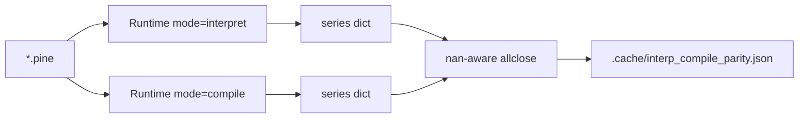

# Copyright (C) 2024-2026 jango_blockchained
#
# This file is part of pynescript.
#
# pynescript is free software: you can redistribute it and/or modify
# it under the terms of the GNU Affero General Public License as published by
# the Free Software Foundation, either version 3 of the License, or
# (at your option) any later version.
#
# pynescript is distributed in the hope that it will be useful,
# but WITHOUT ANY WARRANTY; without even the implied warranty of
# MERCHANTABILITY or FITNESS FOR A PARTICULAR PURPOSE.  See the
# GNU Affero General Public License for more details.
#
# You should have received a copy of the GNU Affero General Public License
# along with pynescript.  If not, see <https://www.gnu.org/licenses/>.
#
# SPDX-License-Identifier: AGPL-3.0-or-later

---
title: "Interpret ↔ compile parity"
description: "Plot-series parity between Runtime interpret and compile modes: harness, tolerances, and known sentinel differences."
---

# Interpret ↔ compile parity

## Abstract

PYNE ships two bar engines that should agree on **numeric plot series** for scripts in the compile surface: the AST interpreter and the generated Numba/object-mode loop. This page is the short contract for that agreement—how to measure it, what “equal” means, and where intentional differences live (`None` vs `nan`, host `time_arr`, structural keys).

Strategy **event** parity (Python vs TypeScript worker) is a separate oracle (`tests/test_parity.py` + fixtures). Here the focus is **plot values** on one host: `backend.runtime.Runtime`.

## Conceptual model



Both modes receive the **same** synthetic (or host) OHLCV. Compile additionally builds **`time_arr`** from bar `time` fields so `time` / calendar expressions line up with the interpret `time` series.

## Interface surface

### Corpus harness

```bash
# From repo root — first-party fixtures by default
python scripts/compare_interp_compile.py --bars 1000 --limit 50
python scripts/compare_interp_compile.py --files tests/fixtures/parity/pine/strategy_01_entry_long.pine
```

| Flag / output | Role |
| --- | --- |
| Default inputs | `tests/fixtures/parity/pine/*.pine` (first-party) |
| Tolerances | `rtol=1e-5`, `atol=1e-6` (nan-aware) |
| Report | `.cache/interp_compile_parity.json` |
| Exit 0 | No value/`nan` mismatches on common series keys |

**Buckets:** `OK`, `fill_background_only`, `both_error_same`, `both_error`, `MISMATCH`, `interp_error`, `compile_error`, `structural_only`. Matched errors on both backends count as success unless `--strict-errors`. Structural key-only differences warn by default; `--strict-keys` fails. `--ignore-hline-keys` / `--ignore-fill-keys` drop one-sided constant hline and fill/background series from residuals.

### Focused unit tests

| Test | Scope |
| --- | --- |
| `tests/test_dividend_yield_parity.py` | Host-series copy-on-assign + time history (interpret/compile) |
| `tests/test_compiler_numba.py` | Kernel-level numeric correctness |
| `tests/test_parity.py` | Strategy **event** fixtures (not plot allclose) |

### Product path

Pro API `/run` defaults to **`mode=auto`**: compile when the script lowers safely, otherwise interpret. Parity harness always forces explicit `interpret` vs `compile` so fallbacks do not hide drift.

## What must match

1. **Common plot keys** — float series after `None`↔`nan` normalization.
2. **Warm-up `na`** — leading missing samples align (interpret `None` / compile `nan`).
3. **`time` / bar-open ms** — when OHLCV includes `time`, or both use the synthetic `i * 60_000` fallback.
4. **Structured errors** — scripts that `runtime.error` (e.g. insufficient pivots) should fail on both with messages that normalize equal (`both_error_same`).

## Intentional / soft differences

| Topic | Policy |
| --- | --- |
| Sentinels | Interpret: `None`; Numba: `np.nan`. Compare with nan-aware equality, not `==`. |
| Hline / fill / bgcolor keys | May appear on one mode only; ignore with harness flags unless you need strict key sets. |
| Unresolved imports / stubs | Non-numeric plot cells serialize as `na` (null)—not string stubs. |
| Outside compile surface | UDT-heavy / full `request.*` / rich strategy analytics stay interpret-first; `auto` falls back. |
| Disk / Numba caches | Stale IR after kernel edits can fake mismatches—clear compile + Numba caches (see harness docstring). |

## Internals

| Path | Role |
| --- | --- |
| `scripts/compare_interp_compile.py` | End-to-end series compare |
| `backend/runtime.py` | `_run_compiled`, `_ohlcv_times_to_array` (`time_arr`) |
| `src/pynescript/compiler/engine.py` | Compile façade + result normalize |
| `src/pynescript/compiler/numba_builtins.py` | JIT kernels under test |

## Worked example

```text
python scripts/compare_interp_compile.py \
  --files tests/fixtures/parity/pine/strategy_01_entry_long.pine \
  --bars 500
# → OK  (or MISMATCH with first differing bar/key in the JSON report)
```

## Failure modes

| Symptom | Likely cause |
| --- | --- |
| Systematic offset after warm-up | EMA/RSI seed or window clamp drift in a kernel |
| Only-compile empty plots | Script still object-mode / plot not lowered; or cache corruption |
| `time` diverges | Host omitted times on one path only; check `time_arr` packing |
| Structural-only keys | hline/fill/background naming — use ignore flags or align collectors |

## See also

- [Compiler overview](/pyne/docs/runtime/compiler/overview)
- [Numba path](/pyne/docs/runtime/compiler/numba)
- [Series & history](/pyne/docs/runtime/series-and-history)
- [Runtime hub](/pyne/docs/runtime)
- [Numerical validation](/pyne/docs/reference/numerical-validation)
- [pine-worker](/pyne/docs/pine-worker) — cross-language event fixtures
