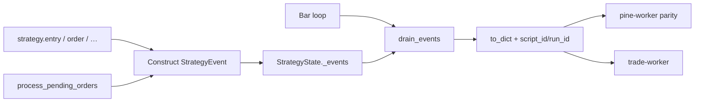

# Copyright (C) 2024-2026 jango_blockchained
#
# This file is part of pynescript.
#
# pynescript is free software: you can redistribute it and/or modify
# it under the terms of the GNU Affero General Public License as published by
# the Free Software Foundation, either version 3 of the License, or
# (at your option) any later version.
#
# pynescript is distributed in the hope that it will be useful,
# but WITHOUT ANY WARRANTY; without even the implied warranty of
# MERCHANTABILITY or FITNESS FOR A PARTICULAR PURPOSE.  See the
# GNU Affero General Public License for more details.
#
# You should have received a copy of the GNU Affero General Public License
# along with pynescript.  If not, see <https://www.gnu.org/licenses/>.
#
# SPDX-License-Identifier: AGPL-3.0-or-later

---
title: "Strategy events"
description: "StrategyEvent shape, emission points, parity corpus, and host serialization."
---

# Strategy events

## Abstract

A **strategy event** is the immutable, structured record of one `strategy.*` action (or fill side-effect) at a specific bar. Events are the wire format between PYNE’s Python evaluator, the TypeScript `pine-worker` port, and downstream HOOX trade workers. Changing the dataclass without updating the TS mirror and parity fixtures is a contract break.

## Conceptual model



## Interface surface

### `StrategyEvent` fields

Defined in `src/pynescript/ast/evaluator/events.py`:

| Field | Type (logical) | Notes |
| --- | --- | --- |
| `kind` | `entry` \| `exit` \| `close` \| `close_all` \| `cancel` \| `cancel_all` \| `order` | Discriminator |
| `id` | `str \| None` | Order / entry id |
| `direction` | `long` \| `short` \| `None` | |
| `qty` | `float \| None` | |
| `order_type` | `market` \| `limit` \| `stop` \| `None` | Stop-limit may appear as composite handling elsewhere |
| `limit` / `stop` | `float \| None` | Prices when relevant |
| `oca_name` | `str \| None` | OCA group |
| `comment` | `str \| None` | Includes system comments (`risk_blocked`, `fill:…`) |
| `bar_index` | `int` | From context at emit |
| `bar_time` | `int` | From context |
| `ohlc` | 4-tuple → list in JSON | Bar snapshot |
| `script_id` | `str` | Host-stamped (source hash) |
| `run_id` | `str` | Host-stamped run uuid |

Frozen dataclass → `to_dict()` always includes keys (JSON nulls for unspecified fields) so parity diffs are stable.

### Emission sources

1. **Explicit builtins** — `strategy.entry`, `exit`, `close`, `close_all`, `cancel`, `cancel_all`, `order` push events as they execute.
2. **Broker fills** — `process_pending_orders` emits fill-related `order` / `entry` / `cancel` (OCA) events.
3. **Risk gates** — blocked entries may emit with `comment="risk_blocked"`.

### Host collection pattern

```python
evaluator.reset_events()
# ... process_pending_orders + visit(tree)
for ev in evaluator._strategy_state.drain_events():
    d = ev.to_dict()
    d["script_id"] = script_id
    d["run_id"] = run_id
    all_events.append(d)
```

`Runtime.run` implements this and returns events in the response envelope.

### Compile path

`CompileStrategyBroker` accumulates plain dict events (`__events` in the return mapping) with the same field names for kinds it supports—use for throughput; full kind coverage trails the interpreter.

## Internals

| Path | Role |
| --- | --- |
| `src/pynescript/ast/evaluator/events.py` | `StrategyEvent` |
| `src/pynescript/ast/evaluator/builtins/strategy.py` | Emit sites + `drain_events` |
| `src/pynescript/compiler/strategy_broker.py` | Compile-mode `_emit` |
| `tests/test_strategy_events.py` | Unit behavior |
| `tests/test_parity.py` + `tests/fixtures/parity/` | Cross-port oracle |
| `pine-worker/src/evaluator/events.ts` | TS twin |

Parity corpus scripts (`strategy_01_entry_long.pine`, …) regenerate expected JSON via:

```bash
python tests/fixtures/parity/generate_fixtures.py
```

Tests strip `script_id` / `run_id` before compare.

## Invariants & edge cases

1. **Immutability.** Do not mutate events after construction; drain copies and clears the buffer.
2. **Per-bar reset.** `reset_events` / drain prevents cross-bar leakage in tests that share evaluators.
3. **OHLC list vs tuple.** `to_dict` converts to list for JSON round-trips.
4. **Kind vocabulary is closed.** New kinds require TS + fixtures + this doc.
5. **Not alerts.** `alert()` uses a separate alerts channel—not `StrategyEvent`.

## Worked examples

### Expected single entry

Script enters long on a fixed bar; fixture JSON lists one event:

```json
{
  "kind": "entry",
  "id": "L",
  "direction": "long",
  "qty": 1.0,
  "order_type": "market",
  "bar_index": 5
}
```

(plus nullables and ohlc—see real fixtures for full keys).

### Cancel after OCA

Fill of one OCA sibling yields `cancel` events for others with `comment` reflecting `oca_cancel` / `oca_reduce`.

## Failure modes

| Symptom | Cause |
| --- | --- |
| Empty events with live strategy | Forgot drain; or strategy never called |
| Parity flake on ids | Comparing `script_id`/`run_id` |
| TS/Python mismatch | Field rename without dual update |
| Duplicate events | Not clearing buffer; double `process_pending_orders` |

## See also

- [Strategy builtins](/pyne/docs/runtime/builtins/strategy)
- [Strategy broker](/pyne/docs/runtime/compiler/strategy-broker)
- [pine-worker](/pyne/docs/pine-worker)
- [HOOX docs](/docs)
