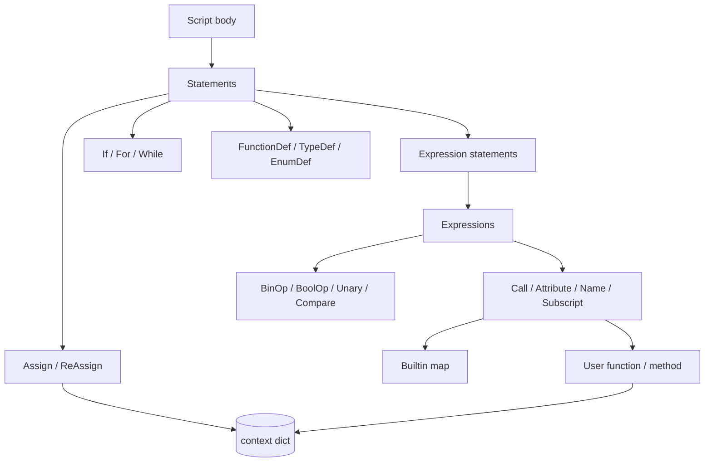

# Expressions and statements

## Abstract

Evaluation is pure visitor dispatch: each ASDL node type maps to a `visit_*` method on a mixin. Expressions produce values (with Pine `na` and series rules); statements mutate context, register types/functions, or emit side effects via builtins. This page is the operational semantics of the interpreter path—what runs inside `evaluator.visit(tree)` each bar.

## Conceptual model



## Interface surface

### Expressions (`ExpressionEvaluator`)

| Node | Behavior |
| --- | --- |
| `BoolOp` (`and` / `or`) | Short-circuit via Python `all` / `any` on visited values |
| `BinOp` | NA-safe `+ - * / %`; division by zero → `na` |
| `UnaryOp` | `not`, unary `+`/`-` with NA and list map |
| `Compare` | Chained comparisons with NA-safe operators |
| `IfExp` | Ternary: condition, then, else |
| `Call` | Builtin dispatch, user functions, methods, multi-dispatch overloads |
| `Tuple` / lists | Literal sequences for unpacking and multi-arg returns |

Binary ops coerce `PineSeries`-like objects to `.current` before operating. List operands broadcast or zip with trailing alignment (see [Series & history](/pyne/docs/runtime/series-and-history)).

### Names (`NameEvaluator`)

| Node | Behavior |
| --- | --- |
| `Name` | Context lookup; bare series builtins (`na`, `year`, …); else string id (lazy) |
| `Attribute` | Qualified context keys, builtins (`strategy.position_size`), library modules, UDT fields/methods, array/drawing/matrix method markers, Python getattr fallback |
| `Subscript` | Series history / array / matrix indexing |

**Critical:** qualified names like `strategy.opentrades.entry_price` are resolved via AST path construction (`ast_qualified_name`) **without** evaluating intermediate zero-arg series that would collapse the path to an int.

### Statements (`StatementEvaluator`)

| Construct | Behavior |
| --- | --- |
| `Script` | Walk body; finalize library exports if `library(...)` active |
| `Assign` | `var`/`varip` once-per-declaration; `const`; ordinary assign; tuple unpack; `export` registration |
| `ReAssign` (`:=`) | Update existing binding (and UDT fields) |
| `If` / `For` / `While` | Standard control flow; loop variables in context |
| `FunctionDef` | Store callable in context; multi-dispatch overload lists; `export`; methods tagged `__pine_method__` |
| `TypeDef` / `EnumDef` | Type registry / enum member dicts |
| `Import` | Resolve `LibraryRegistry` → bind alias to `LibraryModule` |
| Declarations | `indicator` / `strategy` / `library` via declaration builtins |

Function invocation binds parameters into context (with restore of prior bindings on exit) so nested calls and bar-local state interact cleanly. After bar 0, hosts set `_pine_defs_locked` so re-visiting the script does not re-register overload tables.

### Calls and multi-dispatch

Method markers returned from attribute evaluation:

| Marker | Meaning |
| --- | --- |
| `("_method_call", instance, name)` | UDT method |
| `("_array_method", list, name)` | `array.<name>(self, …)` |
| `("_ns_method", obj, "label.get_text")` | Drawing/matrix namespace method |
| `("_ext_method", receiver, name)` | Free `method` with receiver as first arg |

Overloads with typed first parameters (e.g. `matrix.float` vs `array.label`) select via coarse type tags; `na` receivers deliberately exclude matrix/array/drawing tags so optional UDT fields do not mis-dispatch to `tostring` on collections.

## Internals

| Path | Role |
| --- | --- |
| `src/pynescript/ast/evaluator/expressions.py` | Ops, calls, conditionals |
| `src/pynescript/ast/evaluator/names.py` | Names, attributes, subscripts |
| `src/pynescript/ast/evaluator/statements.py` | Script structure, assign, defs, import |
| `src/pynescript/ast/evaluator/literals.py` | Constants, colors, strings |
| `src/pynescript/ast/evaluator/base.py` | Context, math constants, library registry hook |
| `src/pynescript/ast/evaluator/types.py` | `EvaluatorProtocol` typing for mixins |

## Invariants & edge cases

1. **Context is the single store.** Builtins read OHLCV and strategy series from `self.context`; hosts must keep it coherent each bar.
2. **String fallback names.** An unbound `Name` returns its id string so later attribute/call resolution can still hit the builtin map (`"ta.sma"` patterns via attribute chains).
3. **Parameter unbind.** Missing-before-bind params use a sentinel so unbind `pop`s rather than leaving `None` ghosts.
4. **`na` normalization.** String `"na"` / `"nan"` / `"none"` may coerce to `None` at dispatch boundaries for UDT optional args.
5. **User functions re-enter the visitor.** Recursive and higher-order patterns are limited by Python stack, not a Pine-specific trampoline.

## Worked examples

### Ternary and comparison chain

```pine
//@version=5
indicator("cmp")
v = close > open ? close - open : open - close
plot(v)
```

Each operator path is NA-safe: if `close` or `open` were missing, comparisons and arithmetic yield `na`.

### User function with series

```pine
//@version=5
indicator("fn")
f(x, n) =>
    ta.sma(x, n)
plot(f(close, 14))
```

`f` is stored as a Python callable that rebinds `x`/`n` and visits the function body AST each call.

### Method multi-dispatch sketch

```pine
method log(this, string s) => ...
method log(this, float x) => ...
```

Both register under the same name with `__pine_overloads__`; call sites pick by receiver/arg type tags.

## Failure modes

| Error | Meaning |
| --- | --- |
| `unexpected type of node` | Missing `visit_*` for an AST construct |
| `Unsupported binary operator` | Op class not in the dispatch table |
| `Negative indices not supported` | Pine forbids `series[-1]` Python style |
| Wrong overload / destroyed receiver | Historical `na` string path; now normalized—report residual mismatches as bugs |
| Stack overflow | Deep recursion in user functions |

## See also

- [Series & history](/pyne/docs/runtime/series-and-history)
- [Builtins hub](/pyne/docs/runtime/builtins)
- [Libraries](/pyne/docs/runtime/libraries)
- [Type system (core)](/pyne/docs/core/type-system)
