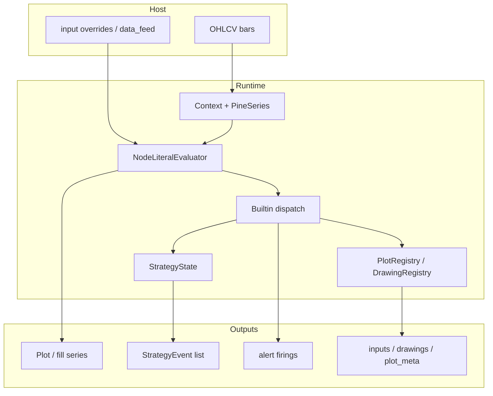

# Copyright (C) 2024-2026 jango_blockchained
#
# This file is part of pynescript.
#
# pynescript is free software: you can redistribute it and/or modify
# it under the terms of the GNU Affero General Public License as published by
# the Free Software Foundation, either version 3 of the License, or
# (at your option) any later version.
#
# pynescript is distributed in the hope that it will be useful,
# but WITHOUT ANY WARRANTY; without even the implied warranty of
# MERCHANTABILITY or FITNESS FOR A PARTICULAR PURPOSE.  See the
# GNU Affero General Public License for more details.
#
# You should have received a copy of the GNU Affero General Public License
# along with pynescript.  If not, see <https://www.gnu.org/licenses/>.
#
# SPDX-License-Identifier: AGPL-3.0-or-later

---
title: "Runtime"
description: "Bar-loop evaluator — series caps, incremental TA, alerts, fill export, foreign request.security → na, and interpret↔compile parity."
---

# Runtime

## Abstract

PYNE’s runtime is the deterministic **bar-loop** that turns a parsed ASDL AST into series values, drawing side-effects, strategy events, and **alerts**. It is deliberately host-agnostic: the same visitor mixins power the library API, the Flask Pro API (`Runtime.run`), browser Pyodide, and edge workers. A second path—source-to-source compilation into a Numba or object-mode bar loop—trades interpretive flexibility for throughput on long histories; Pro API defaults to **`mode=auto`**.

This section documents **semantics**, not the chart. AXIS consumes plots / `fill` / drawings; hosts export alerts (optional L2 webhooks); HOOX consumes strategy events. None of those hosts is required to evaluate a script.

## Conceptual model



**Execution modes** share the same parse tree (Pro API / `Runtime` also expose `auto`):

| Mode | Entry | Bar loop | Typical use |
| --- | --- | --- | --- |
| **Interpret** | `NodeLiteralEvaluator.visit(tree)` per bar | Host updates `PineSeries` / context, re-visits AST | Full language surface, strategy, drawings, alerts, `request.*` |
| **Compile** | `pynescript.compiler.engine.compile_script` | Generated `for __bar_idx in range(n)` over OHLCV + **`time_arr`** | Numeric indicators (Numba) or object-mode subset |
| **Auto** | `Runtime.run(..., mode="auto")` | Compile when safe; interpret on fallback | Pro API default — prefer throughput without hard-failing exotic scripts |

Compile inputs are contiguous arrays: `open_arr` … `vol_arr` plus **`time_arr`** (bar-open Unix ms; synthetic `bar_index * 60_000` when the host omits times) so `time` / calendar builtins match the interpret `time` series. Disk IR cache + product warm-compile (prewarm API/CLI) cut cold JIT latency. See [Compiler overview](/pyne/docs/runtime/compiler/overview) and [Interpret ↔ compile parity](/pyne/docs/runtime/compiler/parity).

**`request.security` (landed):** interpret resamples same-symbol simple OHLCV and allowlisted `ta.sma` / `ema` / `rsi` / `atr` on a **coarser** TF (last **completed** HTF bucket only). Compile passthrough is same-symbol simple OHLCV only. Foreign symbols and complex / nested expressions resolve to **`na`** on both hosts (no inventing chart close as foreign fundamentals). Policy tags land on `result["meta"]["request_security"]`. Real multi-symbol feeds remain adapter work (roadmap **B1**).

**Series caps / incremental TA:** host list trim defaults **on** (`PYNE_SERIES_CAP`); bar-mode TA hot path defaults **on** (`PYNE_TA_INCREMENTAL`). Drawing GC honors `max_*_count` on the interpret registry; `fill` exports series keys + `plot_meta` for AXIS bands.

**Interpret hot path (0.3.10 / Round 9):** the AST walker inlines Assign / `Expr(Call)` after the first bar (function/type/import decls stay locked), skips unused derived OHLCV series (`hl2` / `hlc3` / `ohlc4` / `tr` unless named, `input.source`, or `ta.vwap`), and reuses plot cells by call-site. Same-machine bench @ 2000 bars vs 0.3.9: minimal **2.7×**, `ta.sma` **2.0×**, `ta_combo` **1.45×**. `PYNE_SERIES_RING` stays **off**.

### Host flags and knobs

| Knob | Default | Effect |
| --- | --- | --- |
| `PYNE_SERIES_CAP` | **on** | Trim chronological `current_series` lists (`max_bars_back` / 256) |
| `PYNE_TA_INCREMENTAL` | **on** | Call-site incremental `ta.*` in bar mode |
| `PYNE_SERIES_RING` | **off** | Chronological ring lookback; skip dual list write when on |
| `PYNE_LIGHT_PLOTS` | **off** | Skip plot columns + input meta (corpus OK/fail only) |
| `PYNE_RUNTIME_MODE` | `interpret` | Default when `Runtime.run(mode=)` is omitted (`auto` is the Pro API body default) |
| `timeout_seconds=` | `None` | Interpret wall-clock budget; checked every 32 bars → `timed_out` + `error_kind=runtime` |
| `libraries=` | `[]` | `{namespace, name, version, source}` registered before `import` (auto forwards into interpret fallback) |
| `realtime_*` | historical | Interpret-only `varip` / forming-bar simulation (`realtime_last_bar` / `ticks` / `bars` / `from_bar`) |

## Interface surface

| Concern | Start here |
| --- | --- |
| Series history, `[]`, `var`/`varip`, `PYNE_SERIES_CAP`, `na` | [Series & history](/pyne/docs/runtime/series-and-history) |
| Expressions, statements, control flow | [Expressions & statements](/pyne/docs/runtime/expressions-statements) |
| Builtin namespaces (`ta.*`, `strategy.*`, …) | [Builtins hub](/pyne/docs/runtime/builtins) |
| Drawing / `plot` / `fill` / `max_*_count` GC | [Drawing & plotting](/pyne/docs/runtime/builtins/drawing-plotting) |
| `request.*` / `input.*` (foreign → `na`) | [request / input](/pyne/docs/runtime/builtins/request-input) |
| Library `export` / `import` | [Libraries](/pyne/docs/runtime/libraries) |
| `StrategyEvent` parity contract | [Events](/pyne/docs/runtime/events) |
| `alert()` / webhooks | [Alerts](/pyne/docs/runtime/alerts) |
| Numba / object-mode compiler | [Compiler overview](/pyne/docs/runtime/compiler/overview) |
| Interpret vs compile plot parity | [Parity testing](/pyne/docs/runtime/compiler/parity) |

Library callers typically use `NodeLiteralEvaluator` or the package **`pynescript.runtime.Runtime`** (Pro API re-export) rather than wiring the bar loop by hand:

```python
from pynescript.ast.evaluator import NodeLiteralEvaluator
from pynescript.runtime import Runtime  # package SoT (0.3.4+)

ev = NodeLiteralEvaluator(context={"close": [1.0, 2.0, 3.0], "bar_index": 2})
result = ev.evaluate_script('//@version=6\nindicator("x")\nplot(close)')

# Full bar loop (preferred host API):
# Runtime(symbol="CHART").run(
#     source, ohlcv_data=bars, mode="auto",
#     timeout_seconds=None, libraries=None,
# )
```

Hosts that own OHLCV (Pro API, workers) use the package host: push bar → fill pending orders → `visit(tree)` → drain events → collect plots. **SoT:** `src/pynescript/runtime/` (`host.py`, `series.py`, `evaluator.py`). `backend.runtime` / `backend.series` / `backend.evaluator` are identity re-export shims for the Pro API.

## Internals

| Path | Role |
| --- | --- |
| `src/pynescript/runtime/` | Package Runtime SoT — host, series, CustomEvaluator |
| `src/pynescript/ast/evaluator/` | Mixin evaluators (base, names, expressions, statements, libraries, events) |
| `src/pynescript/ast/evaluator/builtins/` | Builtin dispatch tables |
| `src/pynescript/compiler/` | `CompilerVisitor`, Numba builtins, strategy broker, engine façade |
| `backend/runtime.py` | Compat re-export (`sys.modules` alias) of `pynescript.runtime.host` |
| `tests/test_evaluator.py`, `tests/test_parity.py`, `tests/test_strategy_*.py`, `tests/test_first_party_ta_goldens.py` | Semantic oracles + dual-host TA goldens |

Composition of the full interpreter:

```
BaseEvaluator
  + LiteralEvaluator
  + NameEvaluator
  + ExpressionEvaluator
  + StatementEvaluator
  + BuiltinEvaluator
  → NodeLiteralEvaluator
```

`BuiltinEvaluator` itself aggregates mixins (`TechnicalAnalysisMixin`, `StrategyBuiltinsMixin`, `PlottingFunctionsMixin`, …) into one dispatch map built at construction time.

## Invariants & edge cases

1. **Bar re-entrancy.** The AST is visited once per bar. Function/type definitions lock after bar 0 (`_pine_defs_locked`) so multi-dispatch tables do not grow \(O(\text{bars}^2)\).
2. **Order of broker steps.** Pending limit/stop fills run **before** script body evaluation on each bar (interpreter and compile object-mode agree). Pending-fill averaging when pyramiding ≤ 0 matches both brokers (**F2**).
3. **`na` is `None`.** Unresolved missing data, OOB history, and arithmetic with missing operands produce Python `None`, not IEEE NaN—except on the Numba path, which uses `np.nan` as the array sentinel. Cross-mode plot compares must normalize (`scripts/compare_interp_compile.py`).
4. **Series caps.** Unbounded `current_series` growth is capped (`PYNE_SERIES_CAP` default ON, `max_bars_back` / `_SERIES_MAX`) so long histories stay memory-bounded (**T1**).
5. **Incremental TA.** Hot-path kernels (MAs, oscillators, `bb`/`kama`/`cmo`/`stochrsi`, volume `obv`/`wad`/`cmf`/`klinger`, …) use call-site incremental updates in bar mode (`PYNE_TA_INCREMENTAL=0` to disable). Residual full-list: `ta.nvi` / `ta.pvi` (**T2**).
6. **Strategy state is per-evaluator.** `StrategyState` lives on the instance (`evaluator._strategy_state`), never as a process-global singleton—required for concurrent runs and parity tests.
7. **Drawing/plot registries are side channels.** Visual objects do not participate in pure expression values except where `plot()` returns a plot id for `fill()`. Hosts export `fill` bands for AXIS via series + `plot_meta` (and `__drawings` on compile). Drawing objects honor `max_*_count` GC (package + Pro API + AXIS Pyodide).
8. **Alerts are a host side-channel.** `alert()` / `alertcondition()` firings are not strategy events; dual-host export + L2 webhooks are documented under [Alerts](/pyne/docs/runtime/alerts).
9. **Host series are not aliased on assign.** `last = time` (or `open`/`high`/…) copies the current scalar into a fresh series for `last`—see [Series & history](/pyne/docs/runtime/series-and-history).
10. **Omitted bid/ask stay `na`.** Host `bid` / `ask` update only when those keys appear on a bar dict; they are not synthesized from close.

## Worked example — minimal bar loop mental model

```text
for bar_index, bar in ohlcv:
    open/high/low/close.update(bar)
    context[bar_index, time, barstate, …] = …
    process_pending_orders(OHLC)   # broker sim
    evaluator.visit(ast)           # script body
    events += drain_events()
    series.append(plot values)
```

Compile mode collapses this into one generated function over full arrays (`open_arr`…`vol_arr`, `time_arr`), with `__bar_idx` standing in for `bar_index`.

## Failure modes

| Symptom | Likely cause |
| --- | --- |
| `unexpected type of node: …` | AST node not implemented in any mixin’s `visit_*` |
| `Unknown built-in function: …` | Missing dispatch key or wrong qualified-name resolution |
| Divergent strategy events vs TV | Partial-fill / OCA / risk settings, or fill timing vs bar |
| Numba path raises / falls back | Script uses UDT/map/drawing → object mode; or Numba not installed |
| Plots empty but no error | Host forgot to collect `plot_outputs` / `PlotRegistry` after visit; or `PYNE_LIGHT_PLOTS=1` |
| `timed_out` + partial series | `timeout_seconds` elapsed (checked every 32 interpret bars) |

## See also

- [Language core](/pyne/docs/core) — grammar, AST, types before evaluation
- [Alerts](/pyne/docs/runtime/alerts) — `alert()` engine + L2 webhooks
- [Pro API runtime bridge](/pyne/docs/api/runtime-bridge)
- [Interpret ↔ compile parity](/pyne/docs/runtime/compiler/parity) — `scripts/compare_interp_compile.py`
- [Numerical validation](/pyne/docs/reference/numerical-validation)
- [Roadmap](/pyne/docs/reference/roadmap) — H2/T1/F2/L2 landed; P1p residual
- [pine-worker parity](/pyne/docs/pine-worker)
- [AXIS docs](/axis/docs) — optional AXIS for series/drawings
