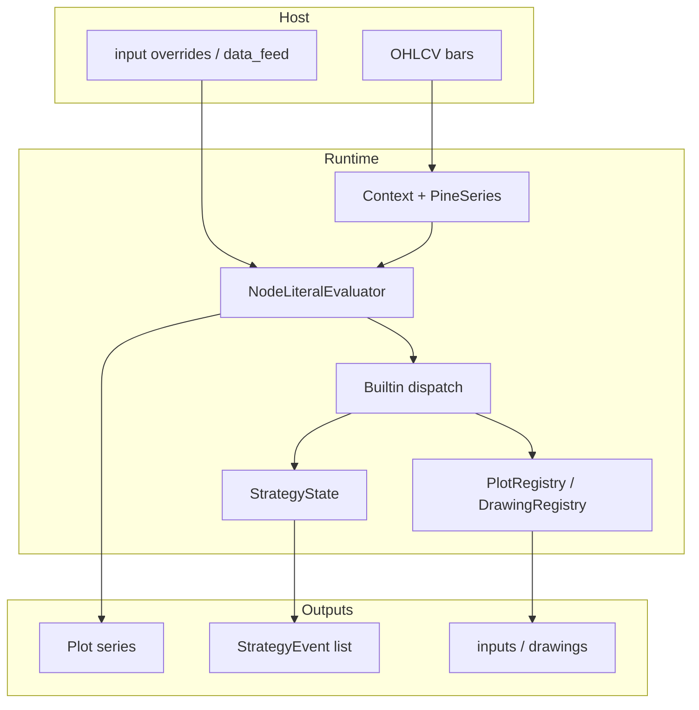

# Copyright (C) 2024-2026 jango_blockchained
#
# This file is part of pynescript.
#
# pynescript is free software: you can redistribute it and/or modify
# it under the terms of the GNU Affero General Public License as published by
# the Free Software Foundation, either version 3 of the License, or
# (at your option) any later version.
#
# pynescript is distributed in the hope that it will be useful,
# but WITHOUT ANY WARRANTY; without even the implied warranty of
# MERCHANTABILITY or FITNESS FOR A PARTICULAR PURPOSE.  See the
# GNU Affero General Public License for more details.
#
# You should have received a copy of the GNU Affero General Public License
# along with pynescript.  If not, see <https://www.gnu.org/licenses/>.
#
# SPDX-License-Identifier: AGPL-3.0-or-later

---
title: "Runtime"
description: "Bar-loop evaluator, series model, builtins, strategy events, and the optional Numba compile path."
---

# Runtime

## Abstract

PYNE’s runtime is the deterministic **bar-loop** that turns a parsed ASDL AST into series values, drawing side-effects, and strategy events. It is deliberately host-agnostic: the same visitor mixins power the library API, the Flask Pro API (`Runtime.run`), browser Pyodide, and edge workers. A second path—source-to-source compilation into a Numba or object-mode bar loop—trades interpretive flexibility for throughput on long histories.

This section documents **semantics**, not the chart. AXIS consumes plots; HOOX consumes strategy events; neither is required to evaluate a script.

## Conceptual model



**Execution modes** share the same parse tree (Pro API / `Runtime` also expose `auto`):

| Mode | Entry | Bar loop | Typical use |
| --- | --- | --- | --- |
| **Interpret** | `NodeLiteralEvaluator.visit(tree)` per bar | Host updates `PineSeries` / context, re-visits AST | Full language surface, strategy, drawings, `request.*` |
| **Compile** | `pynescript.compiler.engine.compile_script` | Generated `for __bar_idx in range(n)` over OHLCV + **`time_arr`** | Numeric indicators (Numba) or object-mode subset |
| **Auto** | `Runtime.run(..., mode="auto")` | Compile when safe; interpret on fallback | Pro API default — prefer throughput without hard-failing exotic scripts |

Compile inputs are contiguous arrays: `open_arr` … `vol_arr` plus **`time_arr`** (bar-open Unix ms; synthetic `bar_index * 60_000` when the host omits times) so `time` / calendar builtins match the interpret `time` series. See [Compiler overview](/pyne/docs/runtime/compiler/overview) and [Interpret ↔ compile parity](/pyne/docs/runtime/compiler/parity).

**`request.security` / missing data:** without a real multi-symbol feed, foreign symbols and non-equity fundamentals soft-fail to **`na`** rather than inventing chart close—do not treat mock OHLCV as TV-grade multi-asset truth.

## Interface surface

| Concern | Start here |
| --- | --- |
| Series history, `[]`, `var`/`varip`, `na` | [Series & history](/pyne/docs/runtime/series-and-history) |
| Expressions, statements, control flow | [Expressions & statements](/pyne/docs/runtime/expressions-statements) |
| Builtin namespaces (`ta.*`, `strategy.*`, …) | [Builtins hub](/pyne/docs/runtime/builtins) |
| Library `export` / `import` | [Libraries](/pyne/docs/runtime/libraries) |
| `StrategyEvent` parity contract | [Events](/pyne/docs/runtime/events) |
| Numba / object-mode compiler | [Compiler overview](/pyne/docs/runtime/compiler/overview) |
| Interpret vs compile plot parity | [Parity testing](/pyne/docs/runtime/compiler/parity) |

Library callers typically use `NodeLiteralEvaluator` (or the Pro API `Runtime`) rather than wiring the bar loop by hand:

```python
from pynescript.ast.evaluator import NodeLiteralEvaluator

ev = NodeLiteralEvaluator(context={"close": [1.0, 2.0, 3.0], "bar_index": 2})
result = ev.evaluate_script('//@version=5\nindicator("x")\nplot(close)')
```

Hosts that own OHLCV (Pro API, workers) implement the loop: push bar → fill pending orders → `visit(tree)` → drain events → collect plots. See `backend/runtime.py` for the reference implementation.

## Internals

| Path | Role |
| --- | --- |
| `src/pynescript/ast/evaluator/` | Mixin evaluators (base, names, expressions, statements, libraries, events) |
| `src/pynescript/ast/evaluator/builtins/` | Builtin dispatch tables |
| `src/pynescript/compiler/` | `CompilerVisitor`, Numba builtins, strategy broker, engine façade |
| `backend/runtime.py` | Production bar loop + `mode="compile"` bridge |
| `tests/test_evaluator.py`, `tests/test_parity.py`, `tests/test_strategy_*.py` | Semantic oracles |

Composition of the full interpreter:

```
BaseEvaluator
  + LiteralEvaluator
  + NameEvaluator
  + ExpressionEvaluator
  + StatementEvaluator
  + BuiltinEvaluator
  → NodeLiteralEvaluator
```

`BuiltinEvaluator` itself aggregates mixins (`TechnicalAnalysisMixin`, `StrategyBuiltinsMixin`, `PlottingFunctionsMixin`, …) into one dispatch map built at construction time.

## Invariants & edge cases

1. **Bar re-entrancy.** The AST is visited once per bar. Function/type definitions lock after bar 0 (`_pine_defs_locked`) so multi-dispatch tables do not grow \(O(\text{bars}^2)\).
2. **Order of broker steps.** Pending limit/stop fills run **before** script body evaluation on each bar (interpreter and compile object-mode agree).
3. **`na` is `None`.** Unresolved missing data, OOB history, and arithmetic with missing operands produce Python `None`, not IEEE NaN—except on the Numba path, which uses `np.nan` as the array sentinel. Cross-mode plot compares must normalize (`scripts/compare_interp_compile.py`).
4. **Strategy state is per-evaluator.** `StrategyState` lives on the instance (`evaluator._strategy_state`), never as a process-global singleton—required for concurrent runs and parity tests.
5. **Drawing/plot registries are side channels.** Visual objects do not participate in pure expression values except where `plot()` returns a plot id for `fill()`.
6. **Host series are not aliased on assign.** `last = time` (or `open`/`high`/…) copies the current scalar into a fresh series for `last`—see [Series & history](/pyne/docs/runtime/series-and-history).

## Worked example — minimal bar loop mental model

```text
for bar_index, bar in ohlcv:
    open/high/low/close.update(bar)
    context[bar_index, time, barstate, …] = …
    process_pending_orders(OHLC)   # broker sim
    evaluator.visit(ast)           # script body
    events += drain_events()
    series.append(plot values)
```

Compile mode collapses this into one generated function over full arrays (`open_arr`…`vol_arr`, `time_arr`), with `__bar_idx` standing in for `bar_index`.

## Failure modes

| Symptom | Likely cause |
| --- | --- |
| `unexpected type of node: …` | AST node not implemented in any mixin’s `visit_*` |
| `Unknown built-in function: …` | Missing dispatch key or wrong qualified-name resolution |
| Divergent strategy events vs TV | Partial-fill / OCA / risk settings, or fill timing vs bar |
| Numba path raises / falls back | Script uses UDT/map/drawing → object mode; or Numba not installed |
| Plots empty but no error | Host forgot to collect `plot_outputs` / `PlotRegistry` after visit |

## See also

- [Language core](/pyne/docs/core) — grammar, AST, types before evaluation
- [Pro API runtime bridge](/pyne/docs/api/runtime-bridge)
- [Interpret ↔ compile parity](/pyne/docs/runtime/compiler/parity)
- [Numerical validation](/pyne/docs/reference/numerical-validation)
- [pine-worker parity](/pyne/docs/pine-worker)
- [AXIS docs](/axis/docs) — optional AXIS for series/drawings
