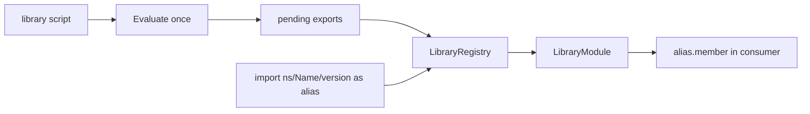

# Libraries

## Abstract

TradingView libraries publish as `namespace/Name/version` with `export`ed members. PYNE implements an **in-process** analogue: evaluate a `library("Title")` script (or register source by path), collect exports (`export const`, exported functions, types), then `import` binds an alias to a `LibraryModule` for `alias.member` access. There is no network publish step—the registry is the host’s responsibility.

## Conceptual model



## Interface surface

### Library script

```pine
//@version=5
library("MyMath")

export add(float a, float b) =>
    a + b

export const float PHI = 1.6180339887
```

On script completion, `StatementEvaluator` finalizes `_pending_library_exports` onto the active `LibraryModule` and calls `LibraryRegistry.register`.

### Consumer import

```pine
//@version=5
indicator("use")
import user/MyMath/1 as M
plot(M.add(close, M.PHI))
```

Resolution (`LibraryRegistry.lookup`):

1. Exact `(namespace, name, version)` if provided and registered.
2. Else title-only match (`MyMath`) for local evaluation workflows without publisher path.

### API on the evaluator

```python
ev.register_library_source(namespace, name, version, source_str)
mod = ev.lookup_library(namespace=..., name=..., version=...)
```

`register_library_source` stores Pine text for **lazy** load on import; evaluating a library script eagerly populates exports.

### `LibraryModule`

Dataclass with `title`, optional `namespace`/`version`, and `exports: dict[str, Any]`. Attribute access reads exports; missing members raise `AttributeError` with a clear message. `NameEvaluator` routes `alias.member` when the base value is a `LibraryModule`.

## Internals

| Path | Role |
| --- | --- |
| `src/pynescript/ast/evaluator/libraries.py` | `LibraryModule`, `LibraryRegistry` |
| `src/pynescript/ast/evaluator/statements.py` | export registration, import visit, library finalize |
| `src/pynescript/ast/evaluator/base.py` | registry fields on `BaseEvaluator` |
| `src/pynescript/ast/evaluator/__init__.py` | `register_library_source`, `lookup_library` |
| `tests/test_library_export_import.py` | Round-trip coverage |

Exportable values include callables (user functions), constants, and type-related bindings depending on declaration paths. Exported methods participate in the same call machinery as local functions once retrieved from the module.

## Invariants & edge cases

1. **Evaluate library before consumer** (or register source for lazy import). Empty registry → import failure.
2. **Same evaluator instance** (or shared registry) must see both scripts—registries are not process-global unless the host shares them.
3. **Version is part of the path key.** Mismatched version does not fall back to another version automatically when namespace is specified.
4. **Title registration** always updates `_by_title` so simple local titles work without publisher metadata.
5. **No TV account auth.** Publishing/versioning outside the process is out of scope.

## Worked examples

### Explicit registration

```python
from pynescript.ast.evaluator import NodeLiteralEvaluator

ev = NodeLiteralEvaluator()
ev.evaluate_script(library_source)   # registers by title
ev.evaluate_script(consumer_source)  # import by title or path
```

### Path registration without pre-eval

```python
ev.register_library_source("user", "MyMath", 1, library_source)
# import user/MyMath/1 loads and evaluates source on demand
```

{/* TODO: verify lazy-load path always evaluates into exports on first import in all hosts */}

## Failure modes

| Symptom | Cause |
| --- | --- |
| Import resolves to nothing | Library never registered / wrong title |
| `Library 'X' has no exported member 'y'` | Missing `export` or typo |
| Stale exports | Re-evaluated library without re-import; host cache |
| Version conflict | Multiple libs same title—last `register` wins for title key |

## See also

- [Expressions & statements](/pyne/docs/runtime/expressions-statements)
- [Builtins declarations](/pyne/docs/runtime/builtins)
- [End-user library API guide](/pyne/docs/enduser/guides/library-api)
