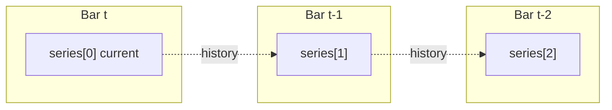

# Series and history

## Abstract

Pine’s core data structure is the **series**: a value that evolves bar by bar, with random access to past values via the history operator `[]`. PYNE implements that model with host-managed series wrappers (`PineSeries` in the Pro API runtime), plain Python lists in unit tests, and flat `numpy` arrays on the compile path. Understanding history indexing and `na` is prerequisite to every builtin and strategy claim.

## Conceptual model



Pine indices are **most-recent-first**:

| Pine | Meaning | List representation (chronological) |
| --- | --- | --- |
| `close[0]` | Current bar | `list[-1]` |
| `close[1]` | Previous bar | `list[-2]` |
| `close[n]` with \(n \ge \text{len}\) | Out of range | `na` (`None`) |

Negative offsets are **not** supported; they raise rather than wrap.

## Interface surface

### History operator (`visit_Subscript`)

Implemented in `NameEvaluator.visit_Subscript`:

- Float indices coerce to `int` (e.g. `depth / 2`); NaN index → `na`.
- Lists map Pine index \(i\) to Python index `-(i + 1)`.
- Scalars: `x[0]` is `x`; `x[i]` for \(i > 0\) is `na` (no history buffer).
- Matrices use `[row, col]` (tuple/list of length 2), not series semantics.

### Series wrappers

Hosts expose OHLCV as objects with:

- `.current` — scalar for the active bar
- `.history` — most-recent-first buffer (deque or list)

Arithmetic in `ExpressionEvaluator` coerces such wrappers via `_as_scalar_operand` so `close + 1` does not attempt object addition.

### `var` / `varip` / `const`

| Qualifier | Semantics in PYNE |
| --- | --- |
| `var` / `varip` | Initializer runs on first **execution** of that declaration site (tracked in `_var_declarations`), not only `bar_index == 0`. Later bars skip re-init so the value carries. |
| `const` (v6) | Always initializes when the statement runs; not a cross-bar carry lock like `var`. |
| bare assign | Re-evaluates every bar; series “history” is the host series or prior list values. |

Nested `var` inside `if barstate.islast` or a function therefore initializes on first path-taken bar—matching Pine’s execution-based persistence.

### `na` propagation

| Operation | Rule |
| --- | --- |
| Binary arithmetic / comparison | Any `None` operand → `None` (or element-wise for lists) |
| Division by zero | → `None` (not exception) |
| Soft type errors (`"a" + 1`) | → `None` |
| Unary | `None` stays `None` |
| History OOB | → `None` |
| Bare name `na` | Builtin / sentinel resolving to `None` |
| `nz(x, r)` (Numba path) | `nan` → replacement |

List-valued series apply operators element-wise, aligning on the **trailing edge** when lengths differ (pad leading `None`).

### Bar mode vs full-series mode

Technical helpers (`technical_submodules/core.py`) distinguish:

- **Full-series mode** (unit tests with explicit lists): `ta.sma` may return a full list of values.
- **Bar mode** (`_pine_bar_mode`): returns the **current scalar** so expressions like `ta.ema(close,12) - ta.ema(close,26)` stay numeric per bar.

History buffers for indicators are truncated to a rolling window (`_SERIES_MAX = 256` for wrapper histories) to avoid \(O(n^2)\) full-history recomputation every bar.

## Internals

| Path | Role |
| --- | --- |
| `src/pynescript/ast/evaluator/names.py` | `visit_Name`, `visit_Attribute`, `visit_Subscript` |
| `src/pynescript/ast/evaluator/expressions.py` | NA-safe binary/unary ops, series coerce |
| `src/pynescript/ast/evaluator/statements.py` | `var`/`varip`/`const` assign |
| `src/pynescript/ast/evaluator/builtins/technical_submodules/core.py` | `_as_series`, bar mode finalize |
| `src/pynescript/ast/evaluator/builtins/utility.py` | `max_bars_back`, `last_bar_index`, `na` helpers |
| `backend/runtime.py` | `PineSeries.update` per bar |

Compile path: series are `np.full(n_bars, np.nan)` written at `__bar_idx`; history is `arr[__bar_idx - n]` (see [Compiler overview](/pyne/docs/runtime/compiler/overview)).

## Invariants & edge cases

1. **Chronology of `.history`.** Most-recent-first; reverse when converting to chronological lists for `ta.*` / `array.*`.
2. **No negative Pine indices.** Explicit error—different from Python lists.
3. **`None` vs `float('nan')`.** Interpreter prefers `None`; Numba kernels use `np.nan`. Cross-mode comparisons must normalize.
4. **`max_bars_back`.** Declares intended depth; PYNE does not hard-cap OHLCV history the way a hosted chart might, but indicator helpers still bound rolling windows for cost.
5. **Tuple returns from multi-value `ta.*`.** Unpacking `[a, b, c] = ta.macd(...)` uses `current` when it is a sequence of matching arity; otherwise history heuristics apply.

## Worked examples

### History lag

```pine
//@version=5
indicator("lag")
delta = close - close[1]
plot(delta)
```

On bar 0, `close[1]` is `na` → `delta` is `na`. On bar 1+, arithmetic is ordinary floats (or series lists in batch tests).

### `var` counter

```pine
//@version=5
indicator("count")
var int n = 0
n := n + 1
plot(n)
```

`n` initializes once; subsequent bars reassignment (`:=`) increments. Declaration sites are recorded in `_var_declarations`.

### Element-wise NA

Given two list series of different lengths, `a + b` aligns tails and pads the longer prefix with `None`—preserving “most recent bars line up” intuition.

## Failure modes

| Symptom | Cause |
| --- | --- |
| All `na` after first bar | Host not updating series / `bar_index` between visits |
| `var` re-inits every bar | Fresh evaluator or `reset_var_declarations` each bar incorrectly |
| TypeError on `close + 1` | Series wrapper missing `.current` / not coerced |
| Compile vs interpret plot mismatch | `nan` vs `None`, or seed differences in EMA/RSI kernels |

## See also

- [Expressions & statements](/pyne/docs/runtime/expressions-statements)
- [Technical builtins](/pyne/docs/runtime/builtins/technical)
- [Numba path](/pyne/docs/runtime/compiler/numba)
- [Runtime hub](/pyne/docs/runtime)
