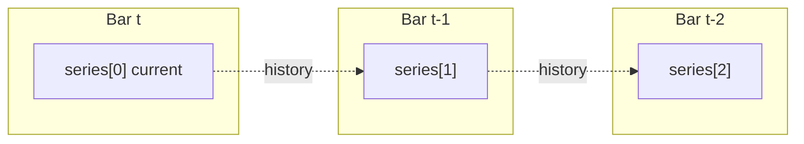

# Copyright (C) 2024-2026 jango_blockchained
#
# This file is part of pynescript.
#
# pynescript is free software: you can redistribute it and/or modify
# it under the terms of the GNU Affero General Public License as published by
# the Free Software Foundation, either version 3 of the License, or
# (at your option) any later version.
#
# pynescript is distributed in the hope that it will be useful,
# but WITHOUT ANY WARRANTY; without even the implied warranty of
# MERCHANTABILITY or FITNESS FOR A PARTICULAR PURPOSE.  See the
# GNU Affero General Public License for more details.
#
# You should have received a copy of the GNU Affero General Public License
# along with pynescript.  If not, see <https://www.gnu.org/licenses/>.
#
# SPDX-License-Identifier: AGPL-3.0-or-later

---
title: "Series and history"
description: "Pine series model: history operator, na propagation, var/varip persistence, and bar-mode scalars."
---

# Series and history

## Abstract

Pine’s core data structure is the **series**: a value that evolves bar by bar, with random access to past values via the history operator `[]`. PYNE implements that model with host-managed series wrappers (`PineSeries` in the Pro API runtime), plain Python lists in unit tests, and flat `numpy` arrays on the compile path. Understanding history indexing and `na` is prerequisite to every builtin and strategy claim.

## Conceptual model



Pine indices are **most-recent-first**:

| Pine | Meaning | List representation (chronological) |
| --- | --- | --- |
| `close[0]` | Current bar | `list[-1]` |
| `close[1]` | Previous bar | `list[-2]` |
| `close[n]` with \(n \ge \text{len}\) | Out of range | `na` (`None`) |

Negative offsets are **not** Python wraparound; they **soft-fail** to `na` (`None`).

## Interface surface

### History operator (`visit_Subscript`)

Implemented in `NameEvaluator.visit_Subscript`:

- Float indices coerce to `int` (e.g. `depth / 2`); NaN index → `na`.
- Lists map Pine index \(i\) to Python index `-(i + 1)`.
- Scalars: `x[0]` is `x`; `x[i]` for \(i > 0\) is `na` (no history buffer).
- Matrices use `[row, col]` (tuple/list of length 2), not series semantics.

### Series wrappers

Hosts expose OHLCV as objects with:

- `.current` — scalar for the active bar
- `.history` — most-recent-first buffer (deque or list)

Arithmetic in `ExpressionEvaluator` coerces such wrappers via `_as_scalar_operand` so `close + 1` does not attempt object addition.

### Assigning host series (copy, not alias)

Binding a **host** multi-bar series into a **new** name copies the current scalar into a fresh series for that name—it does **not** alias the underlying `open` / `high` / `low` / `close` / `volume` / `time` buffers:

```pine
last = time          // copy of current time into series `last`
last := last + 1     // mutates only `last`, never the host `time` buffer
```

Implemented in `StatementEvaluator._bind_series_name`: if the RHS has `.current` / `.history` / `.update` (a host or tracked series), the RHS is reduced to its **current scalar** before allocating or updating the LHS series. Same-bar reassignment (`x = 0` then `x := expr`) overwrites the current sample so `x[1]` remains the previous bar’s final value. This prevents scripts such as dividend TTM time tracking from corrupting `time[j]` history when they rebind through a local.

### `var` / `varip` / `const`

| Qualifier | Semantics in PYNE |
| --- | --- |
| `var` / `varip` | Initializer runs on first **execution** of that declaration site (tracked in `_var_declarations`), not only `bar_index == 0`. Later bars skip re-init so the value carries. History-tracked `var` series get a **start-of-bar carry** (`_commit_unwritten_history`) so `x[1]` is last bar’s persist even when no `:=` ran this bar. On realtime ticks, `varip` re-evaluates the RHS. |
| `const` (v6) | Always initializes when the statement runs; not a cross-bar carry lock like `var`. |
| bare assign | Re-evaluates every bar; series “history” is the host series or prior list values. |

Nested `var` inside `if barstate.islast` or a function therefore initializes on first path-taken bar—matching Pine’s execution-based persistence.

### `na` propagation

| Operation | Rule |
| --- | --- |
| Binary arithmetic / comparison | Any `None` operand → `None` (or element-wise for lists) |
| Division by zero | → `None` (not exception) |
| Soft type errors (`"a" + 1`) | → `None` |
| Unary | `None` stays `None` |
| History OOB | → `None` |
| Bare name `na` | Builtin / sentinel resolving to `None` |
| `nz(x, r)` (Numba path) | `nan` → replacement |

List-valued series apply operators element-wise, aligning on the **trailing edge** when lengths differ (pad leading `None`).

### `ta.highestbars` / `ta.lowestbars` offsets

These return a **bars-back offset** (not the extreme price):

| Result | Meaning |
| --- | --- |
| `0` | Extreme is on the current bar |
| `-1`, `-2`, … | Extreme is 1, 2, … bars ago (down to `-(length-1)`) |
| `-1` sentinel (warm-up / invalid / all-`na`) | Short history (`bar_index+1 < length`), bad length, or no finite samples in the window |

On ties, the **oldest** extreme in the window wins (leftmost bar). Interpret and Numba kernels share this contract (`_highestbars` / `numba_highestbars`).

**History subscript interaction:** Pine history indices are non-negative (`series[n]` with \(n \ge 0\)). Negative indices soft-fail to `na` on interpret series wrappers so warm-up / auto-step-`-1` / `highestbars` misuse do not abort the bar loop. On the compile path, dynamic offsets are coerced float→int (NaN→0) and the computed array index is clamped to `[0, n)` so expressions like `high[-ta.highestbars(...)]` (future-looking form) soft-fail to `nan` near series end rather than raising.

### Bar mode vs full-series mode

Technical helpers (`technical_submodules/core.py`) distinguish:

- **Full-series mode** (unit tests with explicit lists): `ta.sma` may return a full list of values.
- **Bar mode** (`_pine_bar_mode`): returns the **current scalar** so expressions like `ta.ema(close,12) - ta.ema(close,26)` stay numeric per bar.

History buffers for indicators are truncated to a rolling window (`_SERIES_MAX = 256` for wrapper histories) to avoid \(O(n^2)\) full-history recomputation every bar.

### Host series caps (`PYNE_SERIES_CAP`)

Pro API / `pynescript.runtime.Runtime` optionally **trims** chronological `current_series` lists and related host history so long charts do not grow \(O(\text{bars})\) memory per series.

| Knob | Default | Meaning |
| --- | --- | --- |
| `PYNE_SERIES_CAP` | **on** | Enable trimming. Disable with `0` / `false` / `no` / `off` (oracle / debug only). |
| Cap size | `256` (`DEFAULT_SERIES_MAX`) | Raised when the script declares a larger `max_bars_back=…`. |
| `PYNE_SERIES_MAX` | unset | Absolute override of the cap (positive int). |
| PineSeries history floor | `1000` | Separate from list caps; raised by `max_bars_back` / `PYNE_SERIES_MAX`. |

**Correctness notes** (see `src/pynescript/runtime/series.py`; `backend/series.py` is a re-export shim):

- Window kernels (`ta.sma`, `highest`, …) need `length ≤ cap`.
- Recursive smoothers under **incremental** TA (default `PYNE_TA_INCREMENTAL` on) carry state and stay safe independent of list length once warm.
- With **full recompute** (`PYNE_TA_INCREMENTAL=0`) and `bars ≫ cap`, EMA/RMA-style paths can diverge from a full-history oracle—prefer incremental (default) or raise the cap / disable series cap for goldens.

Out-of-range history offsets still return `na` (`None`); never `0`.

### Unused derived series (0.3.10)

The interpret host updates `open` / `high` / `low` / `close` / `volume` / `time` every bar. Derived series (`hl2`, `hlc3`, `ohlc4`, `tr`, `time_close`) are written only when the source names them, uses `input.source`, or calls **`ta.vwap` / `vwap`** (default source is `hlc3` even when that identifier is absent). `ta.ao` rebuilds `hl2` from high/low if the derived list is empty.

`PYNE_SERIES_RING` (chronological tail view) remains **default off**. When on, the host skips the second chronological list write.

## Internals

| Path | Role |
| --- | --- |
| `src/pynescript/ast/evaluator/names.py` | `visit_Name`, `visit_Attribute`, `visit_Subscript` |
| `src/pynescript/ast/evaluator/expressions.py` | NA-safe binary/unary ops, series coerce |
| `src/pynescript/ast/evaluator/statements.py` | `var`/`varip`/`const` assign |
| `src/pynescript/ast/evaluator/builtins/technical_submodules/core.py` | `_as_series`, bar mode finalize |
| `src/pynescript/ast/evaluator/builtins/utility.py` | `max_bars_back`, `last_bar_index`, `na` helpers |
| `src/pynescript/runtime/host.py` | Bar loop; derived-series skip; series-cap trim (`backend.runtime` re-exports) |
| `src/pynescript/runtime/series.py` | `PineSeries`, `resolve_series_cap`, `PYNE_SERIES_CAP` / `PYNE_SERIES_MAX` / `PYNE_SERIES_RING` |

Compile path: series are `np.full(n_bars, np.nan)` written at `__bar_idx`; history is `arr[__bar_idx - n]` with OOB → `np.nan` (see [Compiler overview](/pyne/docs/runtime/compiler/overview)). Host **`time_arr`** is a chronological `float64` vector of bar-open Unix ms (same length as OHLCV); bare `time` lowers to `time_arr[__bar_idx]`, and `time[n]` uses the same history indexing rules as `close[n]`. When the host omits bar times, `Runtime` synthesizes `i * 60_000` so length always matches—calendar / `time` scripts stay defined on both modes.

## Invariants & edge cases

1. **Chronology of `.history`.** Most-recent-first; reverse when converting to chronological lists for `ta.*` / `array.*`. Compile arrays are chronological (index 0 = first bar).
2. **No negative Pine indices.** Soft-fail to `na` / `nan` (not Python wraparound, and **not** a raise)—different from Python lists. See highestbars note above.
3. **`None` vs `float('nan')`.** Interpreter prefers `None`; Numba kernels use `np.nan`. Cross-mode comparisons must normalize.
4. **`max_bars_back`.** Raises the host series cap when larger than the default 256; still not a TV-style hard chart depth, but it affects trim policy.
5. **`PYNE_SERIES_CAP` default on.** Disable only for debugging / full-history oracles; pair with incremental TA for production long histories.
6. **Derived skip.** `ta.vwap()` still requires a live `hlc3` series; the host treats `vwap` as a derived-series consumer.
7. **Tuple returns from multi-value `ta.*`.** Unpacking `[a, b, c] = ta.macd(...)` uses `current` when it is a sequence of matching arity; otherwise history heuristics apply.
8. **Host series assign is by value.** New names never share the host OHLCV/`time` buffer reference.

## Worked examples

### History lag

```pine
//@version=6
indicator("lag")
delta = close - close[1]
plot(delta)
```

On bar 0, `close[1]` is `na` → `delta` is `na`. On bar 1+, arithmetic is ordinary floats (or series lists in batch tests).

### `var` counter

```pine
//@version=6
indicator("count")
var int n = 0
n := n + 1
plot(n)
```

`n` initializes once; subsequent bars reassignment (`:=`) increments. Declaration sites are recorded in `_var_declarations`.

### Element-wise NA

Given two list series of different lengths, `a + b` aligns tails and pads the longer prefix with `None`—preserving “most recent bars line up” intuition.

## Failure modes

| Symptom | Cause |
| --- | --- |
| All `na` after first bar | Host not updating series / `bar_index` between visits |
| `var` re-inits every bar | Fresh evaluator or `reset_var_declarations` each bar incorrectly |
| TypeError on `close + 1` | Series wrapper missing `.current` / not coerced |
| Compile vs interpret plot mismatch | `nan` vs `None`, or seed differences in EMA/RSI kernels — see [parity](/pyne/docs/runtime/compiler/parity) |
| `time[j]` wrong after rebinding `last = time` | Expected only if host series were aliased; verify copy-on-assign path |
| `highestbars` always `-1` | Warm-up (`bar_index+1 < length`) or all-`na` window |
| Long-chart OOM / growing RSS | Series cap disabled or `PYNE_SERIES_MAX` huge; leave `PYNE_SERIES_CAP` on |
| EMA drift after many bars with cap | Full recompute + short cap — enable incremental TA or raise cap |

## See also

- [Expressions & statements](/pyne/docs/runtime/expressions-statements)
- [Technical builtins](/pyne/docs/runtime/builtins/technical)
- [Numba path](/pyne/docs/runtime/compiler/numba)
- [Interpret ↔ compile parity](/pyne/docs/runtime/compiler/parity)
- [Runtime hub](/pyne/docs/runtime)
